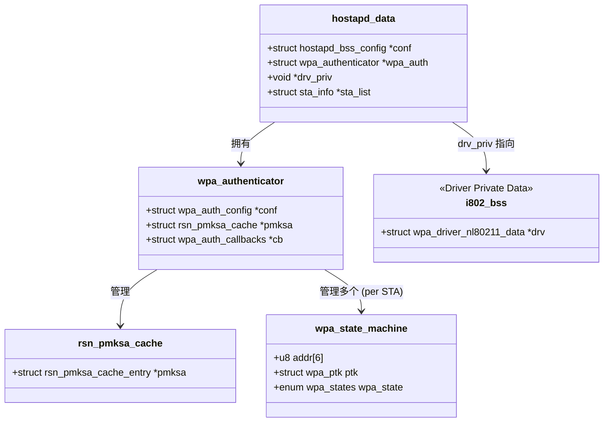

# 1905 EAPOL 4-way Handshake 实现方案分析

本文档基于您描述的 "Split Architecture" (Easymesh 负责 Discovery，hostapd 负责 EAPOL) 完善流程，并解释关键结构体与函数关系。

## 1. 核心设计理念

**为什么 eap1905.c 要复用 `src/ap/wpa_auth.c`？**

`wpa_auth.c` 是 hostapd 中实现 WPA Authenticator 状态机（802.11i/RSN）的核心模块。它已经完整实现了：
1.  **密钥派生**: PTK/GTK 的生成（KDF, PRF 等）。
2.  **EAPOL 帧构造与解析**: 自动处理 Nonce 生成、MIC 计算与验证、重传机制。
3.  **状态机管理**: 处理 4-way handshake 的各个状态（Initialize, PTK-Start, PTK-Done 等）。
4.  **PMKSA 缓存管理**: 管理 PMK 的生命周期。

**eap1905.c 的角色**: 它是一个**适配层 (Adapter)**。
- 它欺骗 `wpa_auth` 以为这是一个普通的 Wi-Fi 连接。
- 它拦截 `wpa_auth` 发出的 EAPOL 帧，通过 1905 链路发送。
- 它将收到的 1905 EAPOL 帧注入回 `wpa_auth`。

## 2. 完善后的详细流程

假设 `eap1905.c` 是 hostapd 中的一个新模块，流程如下：

### 阶段 1: 初始化与 PMK 注入 (Onboarding 完成后)

1.  **外部程序 (Easymesh)**:
    - 完成 DPP Onboarding 和 Network Introduction。
    - 获得对端 (Agent) 的 MAC 地址 (`peer_addr`) 和派生的 PMK (`pmk`, `pmkid`)。
    - 通过 ubus/socket 通知 hostapd 的 `eap1905` 模块。

2.  **eap1905 模块**:
    - **获取上下文**: 获取 `struct hostapd_data *hapd`。
    - **添加 PMKSA**: 调用 `wpa_auth_pmksa_add2()` 将 PMK 注入缓存。
      ```c
      wpa_auth_pmksa_add2(hapd->wpa_auth, peer_addr, pmk, pmk_len, pmkid, timeout, WPA_KEY_MGMT_DPP);
      ```
      *这确保了后续握手时 `wpa_auth` 能找到对应的 PMK。*

### 阶段 2: 模拟关联 (Trigger Handshake)

3.  **eap1905 模块**:
    - **初始化 STA 状态机**: 调用 `wpa_auth_sta_init()` 为该 Peer 创建 `struct wpa_state_machine *sm`。
    - **模拟关联**: 调用 `wpa_auth_sta_associated()`。
      - 这会触发 `wpa_auth` 内部状态机进入 `AUTHENTICATION2` 状态。
      - `wpa_auth` 会查找 PMKSA 缓存（步骤 2 中添加的），找到 PMK。
      - `wpa_auth` 生成 ANonce，构造 **EAPOL-Key Msg 1/4**。

### 阶段 3: EAPOL 帧交互 (1905 隧道)

4.  **发送拦截 (Msg 1/4)**:
    - `wpa_auth` 默认调用 `wpa_auth_callbacks.send_eapol` 发送帧。
    - **关键点**: `eap1905` 需要注册或 hook 这个回调，或者在 `hostapd` 层面区分流量。
    - `eap1905` 捕获该帧，封装进 IEEE 1905 报文 (TLV)，通过 socket 发送给外部 Easymesh 程序。
    - Easymesh 程序将其发送给对端 Agent。

5.  **接收注入 (Msg 2/4)**:
    - Easymesh 程序收到对端的 1905 EAPOL 响应，解包得到 EAPOL-Key Msg 2/4。
    - 传回给 hostapd 的 `eap1905` 模块。
    - `eap1905` 调用 `wpa_receive(hapd->wpa_auth, sm, data, len)` 将帧注入状态机。
    - `wpa_auth` 验证 MIC，处理 SNonce，派生 PTK，构造 **Msg 3/4**。

6.  **后续交互**:
    - 重复上述过程完成 Msg 3/4 和 Msg 4/4 的交互。

7.  **完成**:
    - 握手完成后，`wpa_auth` 进入 `PTKINITDONE` 状态。
    - `eap1905` 可以通过查询状态机确认连接建立。

## 3. 关键结构体与关系图解



### 名词解释与修正

1.  **`struct hostapd_data *hapd`**:
    - **作用**: hostapd 的核心上帝对象，代表一个 BSS (AP 接口)。
    - **关系**: 它是所有其他模块的入口点。

2.  **`struct wpa_authenticator *wpa_auth`**:
    - **作用**: WPA 认证器的上下文。
    - **关系**: 包含全局配置（如 WPA2/WPA3 设置）和 PMKSA 缓存。它不直接包含 STA 的状态，而是管理它们。

3.  **`struct wpa_state_machine *sm` (修正名词)**:
    - 您提到的 "EAPOL/wpa/sm_state 状态机" 准确对应的结构体是 `struct wpa_state_machine`。
    - **作用**: 维护**单个 STA** (Peer) 的 4-way handshake 状态、Nonce、PTK 等。
    - **获取方式**: `wpa_auth_sta_init()` 返回此指针。

4.  **`struct rsn_pmksa_cache`**:
    - **作用**: 存储 PMK 条目 (`rsn_pmksa_cache_entry`)。
    - **函数**: `wpa_auth_pmksa_add2` 实际上是向这里添加条目。

5.  **`void *drv_priv`**:
    - **作用**: 指向驱动特定的私有数据。
    - **修正**: 在常见的 nl80211 驱动中，它通常指向 `struct i802_bss`。
    - **用途**: 当 `wpa_auth` 需要发送 EAPOL 帧或设置密钥到内核时，会通过 `hapd->driver->send_eapol` 等接口，传入 `drv_priv` 作为上下文。
    - **在您的场景中**: 如果是纯 1905 链路，可能不需要调用真实的 Wi-Fi 驱动接口，或者需要一个 "虚拟驱动" 接口来拦截这些调用。

6.  **`struct hostapd_bss_config *conf` (修正 "bss")**:
    - 您提到的 "bss" 可能指配置结构体。它存储 `ssid`, `wpa_key_mgmt` 等配置信息。

## 4. 关键函数 API

| 函数名 | 作用 | 在本方案中的用途 |
| :--- | :--- | :--- |
| `wpa_auth_pmksa_add2` | 添加 PMK 到缓存 | 在握手开始前，注入 DPP 派生的 PMK。 |
| `wpa_auth_sta_init` | 初始化 STA 状态机 | 为对端 Agent 创建状态机实例。 |
| `wpa_auth_sta_associated` | 通知 STA 已关联 | **触发握手的第一步** (发送 Msg 1/4)。 |
| `wpa_receive` | 接收 EAPOL 帧 | 将解包后的 1905 EAPOL 帧注入状态机处理。 |
| `wpa_auth_set_eapol` | 设置 EAPOL 参数 | 用于控制端口状态 (Authorized/Unauthorized)。 |

## 5. 总结

您的思路是可行的。`eap1905.c` 本质上是一个 "Headless STA" 的管理者：
1.  它利用 `wpa_auth` 强大的逻辑处理复杂的密钥握手。
2.  它通过 "伪造" 关联事件 (`wpa_auth_sta_associated`) 来启动流程。
3.  它充当 `wpa_auth` 和 1905 协议栈之间的 "EAPOL 帧路由器"。

**注意**: 这里的 "1905_connector" 应该是指 **DPP Connector**。1905 协议本身没有 connector 的概念，是 DPP Onboarding 过程产出了 Connector 和 Keys，然后用于 1905 链路的建立。
