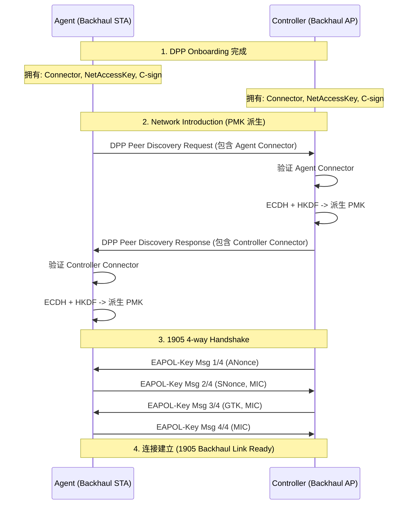

# DPP Onboarding 后派生 1905 PMK 及 4-way Handshake 流程分析

本文档详细解释在 EasyMesh (1905) 环境下，设备完成 DPP Onboarding 后，如何派生 PMK 并进行 4-way Handshake 的完整流程。

## 1. 背景与概念

在 EasyMesh 网络中，DPP (Device Provisioning Protocol) 用于安全地配置和接入 Backhaul STA (Agent) 到 Backhaul BSS (Controller/Agent)。

- **DPP Onboarding**: 配置阶段。Configurator (通常是 Controller) 将配置信息（Connector, Keys）下发给 Enrollee (Agent)。
- **Network Introduction**: 接入前鉴权阶段。双方交换 Connector，验证身份，并派生 PMK。
- **4-way Handshake**: 连接建立阶段。使用派生的 PMK 进行标准的 Wi-Fi 4次握手，生成 PTK/GTK。

## 2. 流程概览

## 3. 详细步骤分析

### 3.1 DPP Onboarding (前置条件)

Onboarding 结束后，Agent 和 Controller 都持有由同一个 Configurator 签发的配置对象，关键字段如下：

- **dpp_connector**: JWS 格式的连接器，包含自身的公钥、组 ID (`groupId`) 和网络角色 (`netRole`)。
  - 在 EasyMesh 中，`netRole` 可能被扩展为 `mapAgent`, `mapController`, `mapBackhaulSta` 等（取决于具体实现）。
- **dpp_netaccesskey**: 自身的私钥，对应 Connector 中的公钥。
- **dpp_csign**: Configurator 的公钥，用于验证对方 Connector 的签名。

### 3.2 Network Introduction & PMK 派生

这是 "1905 PMK" (即 DPP PMK) 生成的关键阶段。

#### 3.2.1 发起请求 (Agent)
Agent (STA) 扫描到 Backhaul BSS 后，发送 `DPP_PA_PEER_DISCOVERY_REQ` 帧。
- **代码位置**: `wpa_supplicant/dpp_supplicant.c: wpas_dpp_check_connect()`
- **内容**: 包含 Agent 的 `dpp_connector`。

#### 3.2.2 处理请求与验证 (Controller)
Controller (AP) 收到请求后，执行 `dpp_peer_intro()` 进行验证。
- **代码位置**: `src/ap/dpp_hostapd.c: hostapd_dpp_rx_peer_disc_req()` -> `src/common/dpp.c: dpp_peer_intro()`

**核心验证逻辑 (`dpp_peer_intro`)**:
1.  **签名验证**: 使用 `dpp_csign` (Configurator 公钥) 验证 Agent Connector 的签名。确保是合法设备。
2.  **角色匹配**: 检查 `groupId` 是否匹配，`netRole` 是否兼容。
    - 标准实现: `sta` vs `ap`。
    - EasyMesh 扩展: 可能涉及 `mapBackhaulSta` vs `mapBackhaulBSS` 的匹配逻辑。
3.  **过期检查**: 检查 Connector 是否过期。
4.  **ECDH 密钥交换**:
    - `N = ECDH(My_PrivKey, Peer_PubKey)`
    - `My_PrivKey`: Controller 的 `dpp_netaccesskey`
    - `Peer_PubKey`: 从 Agent Connector 中提取的公钥
5.  **PMK 派生**:
    - `PMK = HKDF(context, "DPP PMK", N)`
    - 这里的 "DPP PMK" 就是所谓的 "1905 PMK"。
6.  **PMKID 计算**:
    - `PMKID = Truncate-128(Hash(min(K1,K2) | max(K1,K2)))`

#### 3.2.3 响应与验证 (Agent)
Controller 验证通过后，发送 `DPP_PA_PEER_DISCOVERY_RESP`，包含 Controller 的 `dpp_connector`。
Agent 收到后，执行同样的 `dpp_peer_intro()` 流程：
- 验证 Controller 的签名。
- 执行 ECDH。
- 派生出**完全相同**的 PMK 和 PMKID。

#### 3.2.4 缓存 PMKSA
双方将生成的 (PMK, PMKID) 添加到 PMKSA 缓存中，关联到对方的 MAC 地址。

### 3.3 1905 4-way Handshake

一旦 PMK 准备就绪，双方进入标准的 4-way Handshake 流程。

- **触发**: Agent 发送 Association Request，包含 RSN IE，指明使用 DPP AKM (Key Management)。
- **代码位置**:
    - AP: `src/ap/wpa_auth.c`
    - STA: `wpa_supplicant/wpa_supplicant.c`

**握手流程**:
1.  **Msg 1/4**: AP -> STA。携带 `ANonce` (AP 的随机数)。
2.  **Msg 2/4**: STA -> AP。携带 `SNonce` (STA 的随机数) 和 `MIC`。
    - STA 使用缓存的 PMK，结合 ANonce 和 SNonce 生成 PTK。
    - `PTK = KDF(PMK, ANonce, SNonce, MAC_AP, MAC_STA)`
    - 使用 PTK 中的 KCK 计算 MIC。
3.  **Msg 3/4**: AP -> STA。携带 `GTK` (组密钥) 和 `MIC`。
    - AP 收到 Msg 2 后，同样生成 PTK 并验证 MIC。
    - 验证通过表明 STA 拥有正确的 PMK。
4.  **Msg 4/4**: STA -> AP。携带 `MIC`。确认安装密钥。

### 3.4 结果

握手完成后，双方安装 PTK，加密数据通道建立。
对于 EasyMesh，这意味着 **1905 Backhaul Link** 已经建立，可以开始传输 1905 协议报文（如 Topology Discovery, AP Autoconfiguration 等）。

## 4. 关键代码文件索引

- **核心验证与 PMK 派生**: `src/common/dpp.c` (`dpp_peer_intro`, `dpp_derive_pmk`)
- **AP 侧 DPP 处理**: `src/ap/dpp_hostapd.c`
- **STA 侧 DPP 处理**: `wpa_supplicant/dpp_supplicant.c`
- **4-way Handshake**: `src/ap/wpa_auth.c` (AP), `src/rsn_supp/wpa.c` (STA)

## 5. 总结

"1905 PMK" 本质上就是通过 DPP Network Introduction 协议，利用 Onboarding 阶段获得的 Connector 和私钥，通过 ECDH 协商出的共享密钥派生而来的 PMK。这个 PMK 随后被用于标准的 4-way Handshake 来保护 EasyMesh 的 Backhaul 连接。
