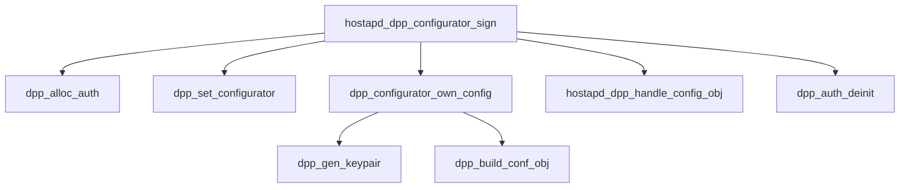

# hostapd_dpp_configurator_sign 函数深度解析

`hostapd_dpp_configurator_sign` 是 DPP 协议中 **Configurator (配置者)** 角色的核心入口函数。它的作用是：**“我是 Configurator，我要给自己签发一个 Connector，或者为某个 Enrollee 签发配置。”** 在 EasyMesh 中，这通常用于 Controller 自生成 Connector 以便进行后续的配网。

## 函数调用链总览



---

## 逐层代码解析

### 1. 入口：`hostapd_dpp_configurator_sign`
位于 `src/ap/dpp_hostapd.c`。

*   **入参**: `cmd` 字符串（例如 `"conf=sta-dpp configurator=1 ssid=MyMesh pass=123..."`）。
*   **分配 Session**:
    ```c
    auth = dpp_alloc_auth(...);
    ```
    创建一个临时的 DPP 认证会话上下文。这一步并不产生网络流量，只是内存分配。

*   **解析配置参数**:
    ```c
    dpp_set_configurator(auth, cmd);
    ```
    这里解析命令行，找出我是哪个 Configurator (`configurator=1`)，以及我要签发什么样的网络配置（SSID, Key 等）。

*   **核心动作：自签发**:
    ```c
    dpp_configurator_own_config(auth, curve, 1 /* ap */);
    ```
    这是重头戏。它告诉底层：“用我选定的 Configurator 身份，给自己（或指定对象）生成一个 **Signed Connector**”。

*   **结果处理**:
    ```c
    hostapd_dpp_handle_config_obj(hapd, auth, &auth->conf_obj[0]);
    ```
    生成完毕后，把结果（Connector 字符串、密钥等）通过 `wpa_msg` 打印出来，供上层应用（如 `map`）获取。

---

### 2. 核心 1：`dpp_set_configurator` (参数解析)
位于 `src/common/dpp.c`。

*   **查找 Configurator**:
    *   解析 `configurator=N`。
    *   在全局链表 `dpp->configurator` 中找到对应的 `struct dpp_configurator` 实例。这个实例里包含最重要的 **C-Sign-Key (私钥)**。
*   **解析网络配置**:
    *   调用 `dpp_configuration_parse(auth, cmd)`。
    *   把 `ssid=...`, `pass=...` 等参数解析并存入 `auth->conf_obj` 中。这些稍后会被打包进 Connector 或 Configuration Object。

---

### 3. 核心 2：`dpp_configurator_own_config` (签发逻辑)
位于 `src/common/dpp.c`。

*   **生成身份密钥 (netAccessKey)**:
    ```c
    auth->own_protocol_key = dpp_gen_keypair(auth->curve);
    ```
    这就是 Connector 里那个核心的 `netAccessKey`。为每次签发随机生成一对新的 ECC 公私钥。

*   **构建配置对象 (JSON)**:
    ```c
    conf_obj = dpp_build_conf_obj(auth, ap, ...);
    ```
    这个函数会做以下几件事：
    1.  构造 JSON (包含 `groups`, `netAccessKey` 公钥, `expiry` 等)。
    2.  **签名**：使用 Configurator 的 `csign` (私钥) 对 JSON 进行 JWS 签名。
    3.  **封装**：生成最终的 `"eyJh...` 字符串（即 Connector）。

---

### 4. 核心 3：`hostapd_dpp_handle_config_obj` (结果输出)
位于 `src/ap/dpp_hostapd.c`。

*   **作用**: 把内存里的二进制数据转成 Hex 字符串或文本，打印给用户。
*   **打印内容**:
    *   `DPP-CONNECTOR`: 签发好的 Connector 字符串。
    *   `DPP-NET-ACCESS-KEY`: 上一步生成的私钥 (Hex)。
    *   `DPP-C-SIGN-KEY`: Configurator 的公钥 (Hex)。
    *   `DPP-SSID` / `DPP-PSK` / `DPP-PASSPHRASE`: 网络配置信息。

上层应用（如 1905 Controller）监听到这些 Event 后，就把它们存起来，用于后续的握手。

---

## 总结

`hostapd_dpp_configurator_sign` 是一个**“制证”**过程。

1.  **准备**: 准备好印章 (C-Sign-Key) 和 表格内容 (SSID/PSK)。
2.  **制证**:
    *   生成一个新的身份 (netAccessKey)。
    *   填表 (Build JSON)。
    *   盖章 (Sign with C-Sign-Key)。
3.  **交付**: 把做好的“身份证” (Connector) 和“私钥” (netAccessKey) 交给调用者。
