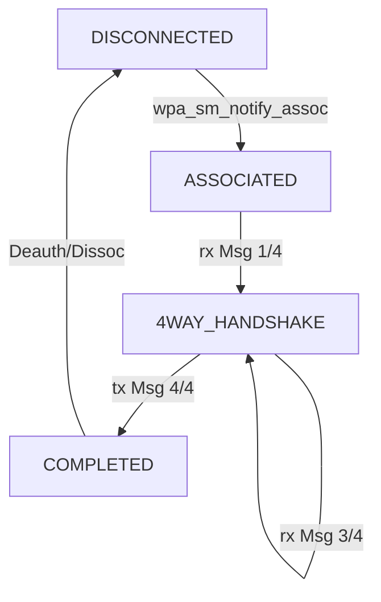

# WPA/RSN 深度概念与状态机内幕

针对您的疑问，这里从术语源头到代码实现进行深度剖析。

## 1. 术语正本清源：WPA vs RSN

这两个词经常混用，但在代码中（以及 IEEE 标准中）有严格区分：

| 术语 | 全称 | 来源 | 技术本质 | 代码中的体现 |
| :--- | :--- | :--- | :--- | :--- |
| **WPA** | **W**i-Fi **P**rotected **A**ccess | Wi-Fi 联盟 (WFA) | **过渡方案 (Draft)**。在 802.11i 标准正式定稿前，为了救急 WEP 的安全漏洞而推出的子集。核心是 **TKIP** 加密。 | `WPA_PROTO_WPA` (0x1), `WPA_CIPHER_TKIP` |
| **RSN** | **R**obust **S**ecurity **N**etwork | IEEE 802.11i | **正式标准**。也就是常说的 **WPA2**。核心是 **CCMP (AES)** 加密。 | `WPA_PROTO_RSN` (0x2), `WPA_CIPHER_CCMP` |

**关键区别**:
*   **WPA**: 使用 **WPA IE** (Vendor Specific OUI)。
*   **RSN (WPA2/3)**: 使用 **RSN IE** (Standard Element ID 48)。
*   在 `eap1905_sta` 中，显然我们跑的是 **RSN** (WPA2/3)，所以一定要设置 `WPA_PROTO_RSN`。

---

## 2. WPA 状态机内幕 (State Machine Internals)

状态机由 `src/common/defs.h` 中的 `enum wpa_states` 定义。它是 **Supplicant 的生命周期**。

### 2.1 状态全景图与含义

1.  **`WPA_DISCONNECTED` (入口)**
    *   **含义**: 初始状态，或者断开了。无依无靠。
    *   **动作**: 什么都不做，等待选网。

2.  **`WPA_SCANNING`**
    *   **含义**: 正在扫描信道，寻找目标 AP。

3.  **`WPA_ASSOCIATING`**
    *   **含义**: 选中了 AP，正在发 Auth/Assoc 帧。

4.  **`WPA_ASSOCIATED` (关键节点)**
    *   **含义**: 链路物理层通了 (L2 Connected)！但端口未授权 (L3 Blocked)，不能传数据。
    *   **触发**: `wpa_sm_notify_assoc()` 将状态机置于此状态。
    *   **动作**: 准备好了 PMK，静静等待 AP 发送 **Msg 1/4**。

5.  **`WPA_4WAY_HANDSHAKE`**
    *   **含义**: 收到了 Msg 1/4，握手正式开始。
    *   **动作**: 计算 PTK，验证 MIC，发送 Msg 2/4 和 4/4。
    *   **细节**: 此状态在代码逻辑中可能是一瞬间（处理 Msg1 时进入，发完 Msg4 可能就跳走了），或者是持续的（等待 Msg 3/4 时）。

6.  **`WPA_GROUP_HANDSHAKE`**
    *   **含义**: 4-Way 完成后，或者后期 AP 要换 GTK 时，进行组播密钥更新。

7.  **`WPA_COMPLETED` (出口/终态)**
    *   **含义**: 握手全部成功，Keys 已安装到驱动。
    *   **动作**: 打开 802.1X 端口 (`eapol_sm_notify_portValid(true)`)，允许 DHCP 和数据流量通过。

### 2.2 入口与出口

*   **入口函数**: `wpa_sm_rx_eapol()`
    *   这是驱动状态机流转的**唯一动力源**。
    *   例如：收到 Msg 1/4 -> 状态从 `ASSOCIATED` 变 `4WAY_HANDSHAKE`。

*   **逻辑入口**: `wpa_sm_notify_assoc()`
    *   这是**预备动作**，把状态机摆到起跑线上 (`ASSOCIATED`)。

*   **出口**:
    *   **成功**: 到达 `WPA_COMPLETED`，状态机进入休眠，只响应 Rekey 事件。
    *   **失败**: 发生超时、MIC 错误 -> 调用 `wpa_sm_deauthenticate()`，状态回到 `DISCONNECTED`。

### 2.3 状态流转图解 (The Flow)

---

## 3. 细节函数再提问

您之前的疑问中提到了几个特定函数，现在结合状态机再讲得透一点：

*   `wpa_sm_notify_assoc`
    *   **真的不阻塞吗？** 真的。它只是置个标志位 `sm->wpa_state = WPA_ASSOCIATED`，清零 `rx_replay_counter`。也就是把桌子收拾干净，准备上菜。
*   `wpa_sm_rx_eapol`
    *   **它是怎么工作的？** 它里面是一大坨 `if/else` 判断：
        *   是 Msg 1/4 吗？是 -> `wpa_supplicant_process_1_of_4()`
        *   是 Msg 3/4 吗？是 -> `wpa_supplicant_process_3_of_4()`
    *   每个 `process` 函数执行完后，会根据情况更新 `sm->wpa_state`。

**总结给初学者**:
把 WPA 状态机想象成一个**自动售货机**：
1.  `ibss_rsn_supp_init`: 把售货机搬来，插上电 (malloc, init)。
2.  `set_param/pmk`: 往里面装填货品 (Key, Config)。
3.  `notify_assoc`: 打开售货机开关，亮灯，显示“欢迎光临” (`ASSOCIATED` 状态)。
4.  `rx_eapol (Msg 1/4)`: 顾客（AP）投了一枚硬币（ANonce）。
5.  售货机内部咔嚓咔嚓运转（算 PTK），吐出一瓶水（Msg 2/4）。
6.  `rx_eapol (Msg 3/4)`: 顾客又投了一枚硬币。
7.  售货机吐出找零（Msg 4/4），并显示“谢谢惠顾” (`COMPLETED`)。

这一切都是**事件驱动**的，没人投币（调函数），它就永远不动。
