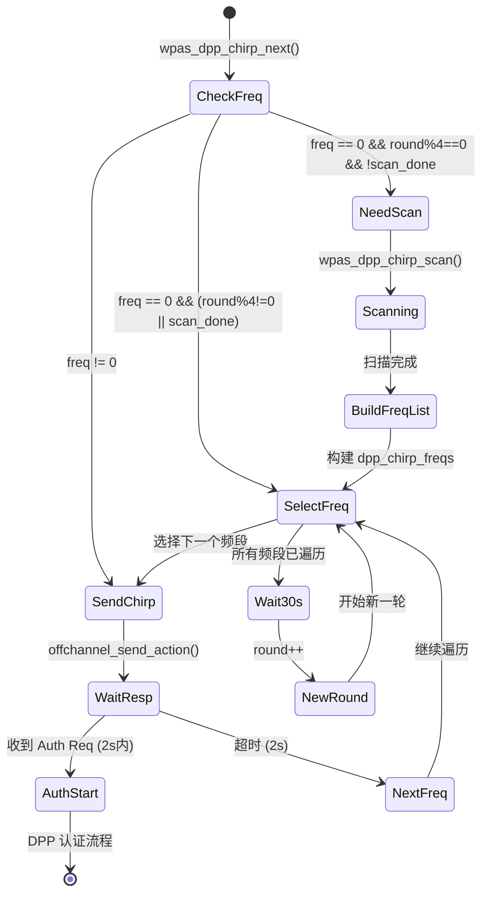
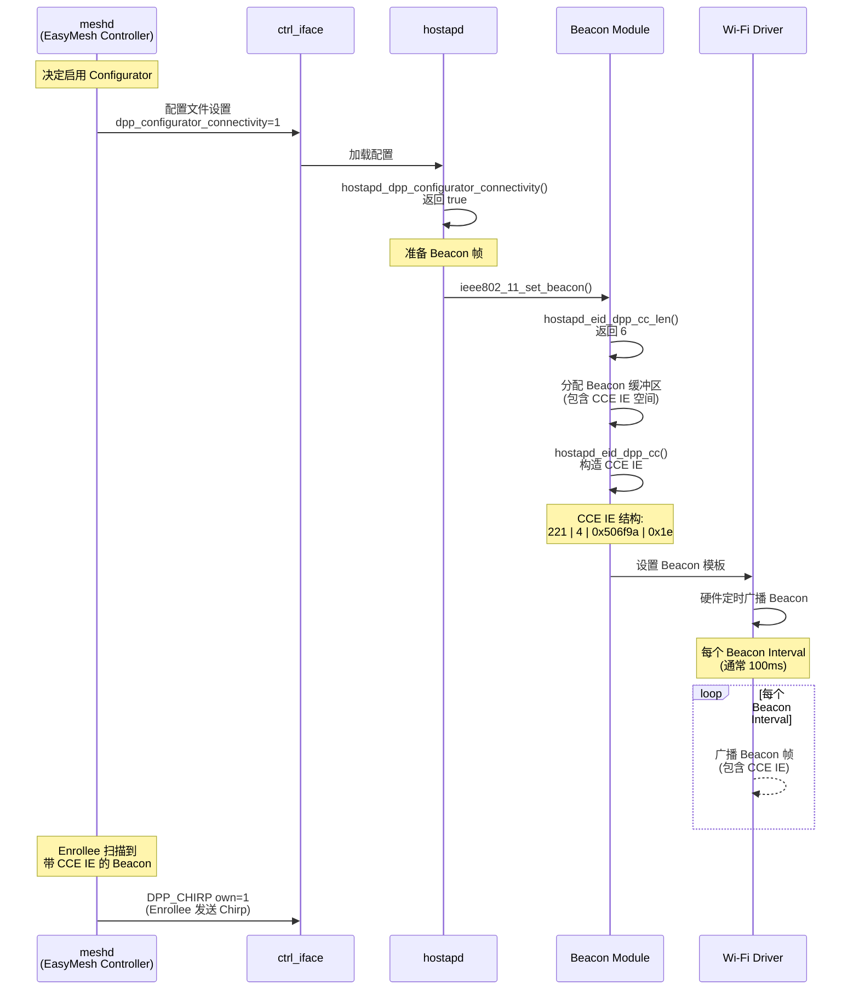
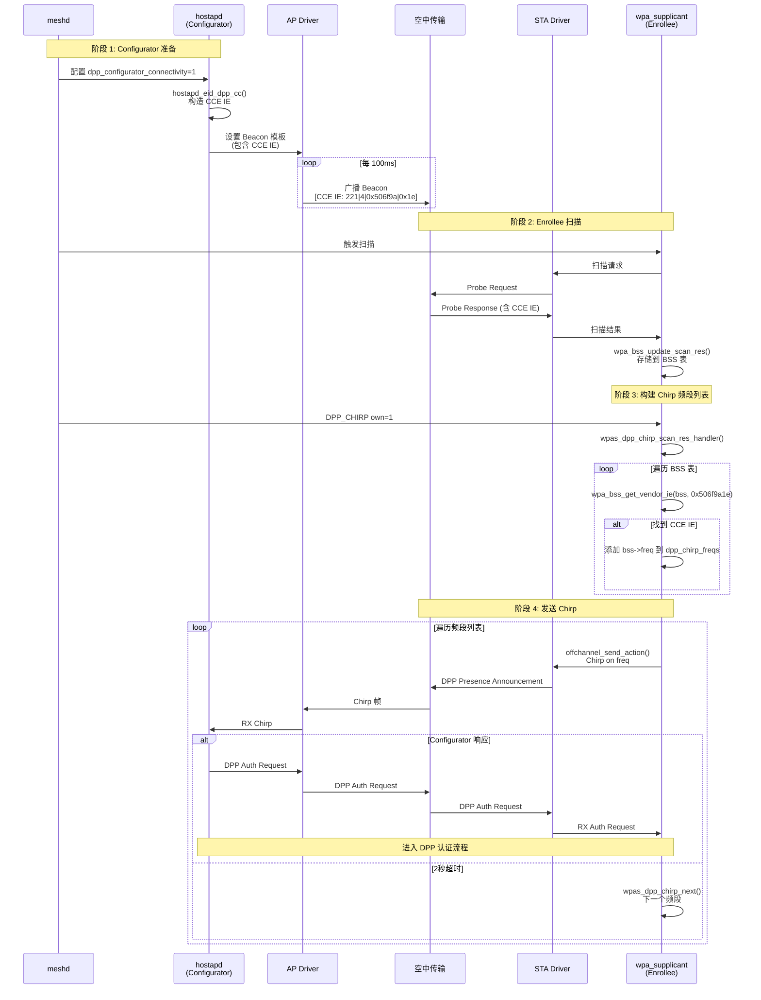

# DPP CCE_IE 与 Chrip 问题

## 任务一：DPP EasyMesh 协议基础 ✅

### 1. CCE (Configurator Connectivity Element) IE

#### 定义与常量
**位置**: [ieee802_11_defs.h:1362-1363](file:///home/soho/code/hostapd-wpad-basic-openssl/hostapd-2022-07-29-b704dc72-patched/src/common/ieee802_11_defs.h#L1362-L1363)

```c
#define DPP_CC_IE_VENDOR_TYPE 0x506f9a1e
#define DPP_CC_OUI_TYPE 0x1e
```

#### 结构与作用
- **Element ID**: 221 (WLAN_EID_VENDOR_SPECIFIC)
- **OUI**: 0x506f9a (Wi-Fi Alliance)
- **OUI Type**: 0x1e
- **完整 Vendor Type**: 0x506f9a1e

**作用**:
- 在 Beacon/Probe Response 帧中广播
- 告知 Enrollee 附近有 DPP Configurator 可用
- 包含 Configurator 的连接信息（如 MAC 地址、操作信道等）

#### 解析处理
**位置**: [ieee802_11_common.c:136-138](file:///home/soho/code/hostapd-wpad-basic-openssl/hostapd-2022-07-29-b704dc72-patched/src/common/ieee802_11_common.c#L136-L138)

```c
case DPP_CC_OUI_TYPE:
    /* DPP Configurator Connectivity element */
    break;
```

> [!IMPORTANT]
> CCE IE 在 `ieee802_11_parse_vendor_specific()` 中被识别但**不存储**到 `ieee802_11_elems` 结构中。需要通过 `wpa_bss_get_vendor_ie(bss, DPP_CC_IE_VENDOR_TYPE)` 单独提取。

---

### 2. DPP Chirp (Presence Announcement) 帧

#### 定义
DPP Presence Announcement 是 Enrollee 用来宣告自己存在并寻找 Configurator 的**公共 Action 帧**。

#### 帧类型
- `DPP_PA_PRESENCE_ANNOUNCEMENT` - 普通 Chirp（首次配置）
- `DPP_PA_RECONFIG_ANNOUNCEMENT` - 重配置 Chirp（已配置设备重新加入）

#### 发送方式
- **函数**: `offchannel_send_action()`
- **目标地址**: `ff:ff:ff:ff:ff:ff` (广播)
- **超时**: 2000ms
- **回调**: `wpas_dpp_chirp_tx_status()`

**关键代码** - [wpas_dpp_chirp_start](file:///home/soho/code/hostapd-wpad-basic-openssl/hostapd-2022-07-29-b704dc72-patched/wpa_supplicant/dpp_supplicant.c#L4880):

```c
offchannel_send_action(
    wpa_s, wpa_s->dpp_chirp_freq, broadcast,
    wpa_s->own_addr, broadcast,
    wpabuf_head(msg), wpabuf_len(msg),
    2000, wpas_dpp_chirp_tx_status, 0);
```

---

### 3. supplicant 如何在指定/遍历频段发出 Chirp 帧（重点）

#### 3.1 关键数据结构

**wpa_supplicant 结构中的 Chirp 状态** - [wpa_supplicant_i.h:1495-1501](file:///home/soho/code/hostapd-wpad-basic-openssl/hostapd-2022-07-29-b704dc72-patched/wpa_supplicant/wpa_supplicant_i.h#L1495-L1501):

```c
struct dpp_bootstrap_info *dpp_chirp_bi;      // Bootstrap 信息（包含公钥）
int dpp_chirp_freq;                            // 当前发送 Chirp 的频段
int *dpp_chirp_freqs;                          // 频段列表数组（动态分配）
int dpp_chirp_iter;                            // 迭代次数（从 ctrl_iface 命令获取）
int dpp_chirp_round;                           // 当前轮次计数器
int dpp_chirp_scan_done;                       // 扫描完成标志
int dpp_chirp_listen;                          // 监听频段（可选）
```

#### 3.2 频段列表构建

**触发时机**: 每 4 轮 Chirp 触发一次扫描

**构建函数**: [wpas_dpp_chirp_scan_res_handler](file:///home/soho/code/hostapd-wpad-basic-openssl/hostapd-2022-07-29-b704dc72-patched/wpa_supplicant/dpp_supplicant.c#L4917)

**频段来源**（按优先级）:

1. **Bootstrap Info 中的频段**
   ```c
   for (i = 0; i < bi->num_freq; i++)
       int_array_add_unique(&wpa_s->dpp_chirp_freqs, bi->freq[i]);
   ```

2. **扫描结果中带 CCE IE 的 AP 频段**（核心）
   ```c
   dl_list_for_each(bss, &wpa_s->bss, struct wpa_bss, list) {
       if (wpa_bss_get_vendor_ie(bss, DPP_CC_IE_VENDOR_TYPE))
           int_array_add_unique(&wpa_s->dpp_chirp_freqs, bss->freq);
   }
   ```

3. **支持的操作信道**
   - 2.4GHz: 信道 1, 6, 11
   - 5GHz: 所有非 DFS 信道
   - 6GHz: 信道 2 (6GHz PSC)

#### 3.3 频段遍历状态机

**核心函数**: [wpas_dpp_chirp_next](file:///home/soho/code/hostapd-wpad-basic-openssl/hostapd-2022-07-29-b704dc72-patched/wpa_supplicant/dpp_supplicant.c#L4848)

**流程图**:



**关键代码逻辑**:

```c
static void wpas_dpp_chirp_next(void *eloop_ctx, void *timeout_ctx)
{
    struct wpa_supplicant *wpa_s = eloop_ctx;
    int i;

    if (wpa_s->dpp_chirp_listen)
        wpas_dpp_listen_stop(wpa_s);

    // 状态1: 需要选择新频段
    if (wpa_s->dpp_chirp_freq == 0) {
        // 每4轮触发一次扫描
        if (wpa_s->dpp_chirp_round % 4 == 0 && !wpa_s->dpp_chirp_scan_done) {
            wpas_dpp_chirp_scan(wpa_s);  // 触发扫描
            return;
        }

        // 遍历频段列表
        for (i = 0; wpa_s->dpp_chirp_freqs && wpa_s->dpp_chirp_freqs[i]; i++) {
            // 选择下一个未使用的频段
            wpa_s->dpp_chirp_freq = wpa_s->dpp_chirp_freqs[i];
            break;
        }

        // 所有频段已遍历完
        if (wpa_s->dpp_chirp_freq == 0) {
            wpa_s->dpp_chirp_round++;
            wpa_s->dpp_chirp_scan_done = 0;
            
            // 等待30秒后开始新一轮
            eloop_register_timeout(30, 0, wpas_dpp_chirp_next, wpa_s, NULL);
            
            // 可选: 在等待期间监听
            if (wpa_s->dpp_chirp_listen) {
                wpas_dpp_listen_start(wpa_s, wpa_s->dpp_chirp_listen);
            }
            return;
        }
    }

    // 状态2: 在当前频段发送 Chirp
    wpas_dpp_chirp_start(wpa_s);
}
```

**超时处理** - [wpas_dpp_chirp_timeout](file:///home/soho/code/hostapd-wpad-basic-openssl/hostapd-2022-07-29-b704dc72-patched/wpa_supplicant/dpp_supplicant.c#L4850):

```c
static void wpas_dpp_chirp_timeout(void *eloop_ctx, void *timeout_ctx)
{
    struct wpa_supplicant *wpa_s = eloop_ctx;
    
    wpa_printf(MSG_DEBUG, "DPP: No chirp response received");
    offchannel_send_action_done(wpa_s);
    wpas_dpp_chirp_next(wpa_s, NULL);  // 继续下一个频段
}
```

#### 3.4 ctrl_iface 命令接口

**命令格式**: `DPP_CHIRP own=<BI_ID> [iter=<count>] [listen=<freq>]`

**处理函数**: [wpas_dpp_chirp](file:///home/soho/code/hostapd-wpad-basic-openssl/hostapd-2022-07-29-b704dc72-patched/wpa_supplicant/dpp_supplicant.c#L4999)

```c
int wpas_dpp_chirp(struct wpa_supplicant *wpa_s, const char *cmd)
{
    const char *pos;
    int iter = 1, listen_freq = 0;
    struct dpp_bootstrap_info *bi;

    // 解析 own= 参数（必需）
    pos = os_strstr(cmd, " own=");
    bi = dpp_bootstrap_get_id(wpa_s->dpp, atoi(pos + 5));

    // 解析 iter= 参数（可选，默认1）
    pos = os_strstr(cmd, " iter=");
    if (pos)
        iter = atoi(pos + 6);

    // 解析 listen= 参数（可选）
    pos = os_strstr(cmd, " listen=");
    if (pos)
        listen_freq = atoi(pos + 8);

    // 初始化 Chirp 状态
    wpas_dpp_chirp_stop(wpa_s);
    wpa_s->dpp_chirp_bi = bi;
    wpa_s->dpp_chirp_iter = iter;
    wpa_s->dpp_chirp_round = 0;
    wpa_s->dpp_chirp_scan_done = 0;
    wpa_s->dpp_chirp_listen = listen_freq;
    
    // 构建 Presence Announcement 帧
    wpa_s->dpp_presence_announcement = dpp_build_presence_announcement(bi);

    // 启动 Chirp 流程
    return eloop_register_timeout(0, 0, wpas_dpp_chirp_next, wpa_s, NULL);
}
```

**示例命令**:
```bash
# 基本用法
wpa_cli -i wlan0 dpp_chirp own=1

# 指定迭代次数
wpa_cli -i wlan0 dpp_chirp own=1 iter=10

# 指定监听频段
wpa_cli -i wlan0 dpp_chirp own=1 listen=2437
```

---

## 任务二：hostapd 侧 CCE IE 广播实现 ✅

### 1. CCE IE 数据结构与构造函数

#### 1.1 CCE IE 构造函数

**位置**: [ieee802_11_shared.c:884-900](file:///home/soho/code/hostapd-wpad-basic-openssl/hostapd-2022-07-29-b704dc72-patched/src/ap/ieee802_11_shared.c#L884-L900)

```c
u8 * hostapd_eid_dpp_cc(struct hostapd_data *hapd, u8 *eid, size_t len)
{
    u8 *pos = eid;

#ifdef CONFIG_DPP2
    if (!hostapd_dpp_configurator_connectivity(hapd) || len < 6)
        return pos;

    *pos++ = WLAN_EID_VENDOR_SPECIFIC;  // Element ID = 221
    *pos++ = 4;                          // Length = 4
    WPA_PUT_BE24(pos, OUI_WFA);          // OUI = 0x506f9a
    pos += 3;
    *pos++ = DPP_CC_OUI_TYPE;            // OUI Type = 0x1e
#endif /* CONFIG_DPP2 */

    return pos;
}
```

**CCE IE 结构**:
```
+--------+--------+--------+--------+--------+--------+
| EID    | Length | OUI (3 bytes)    | OUI    |
| 221    | 4      | 0x50 0x6f 0x9a   | Type   |
|        |        |                  | 0x1e   |
+--------+--------+--------+--------+--------+--------+
```

**长度计算函数** - [ieee802_11_shared.c:874-881](file:///home/soho/code/hostapd-wpad-basic-openssl/hostapd-2022-07-29-b704dc72-patched/src/ap/ieee802_11_shared.c#L874-L881):

```c
size_t hostapd_eid_dpp_cc_len(struct hostapd_data *hapd)
{
#ifdef CONFIG_DPP2
    if (hostapd_dpp_configurator_connectivity(hapd))
        return 6;  // 2 (EID + Length) + 4 (OUI + OUI Type)
#endif
    return 0;
}
```

### 2. Beacon/Probe Response 帧集成

#### 2.1 Probe Response 帧

**位置**: [beacon.c:465-706](file:///home/soho/code/hostapd-wpad-basic-openssl/hostapd-2022-07-29-b704dc72-patched/src/ap/beacon.c#L465-L706)

**长度计算** (line 523):
```c
buflen += hostapd_eid_dpp_cc_len(hapd);
```

**IE 添加** (line 696):
```c
pos = hostapd_eid_dpp_cc(hapd, pos, (u8 *) resp + buflen - pos);
```

**Probe Response 帧结构**:
```
Probe Response Frame
├── MAC Header
├── Fixed Parameters (timestamp, beacon_int, capab_info)
├── SSID IE
├── Supported Rates IE
├── DS Params IE
├── ... (其他 IE)
├── MBO IE
├── OWE Transition IE
├── DPP CC IE  ← 在这里添加
└── Vendor Elements
```

#### 2.2 Beacon 帧

**位置**: [beacon.c:1400-1900](file:///home/soho/code/hostapd-wpad-basic-openssl/hostapd-2022-07-29-b704dc72-patched/src/ap/beacon.c#L1400-L1900)

**长度计算** (line 1584):
```c
tail_len += hostapd_eid_dpp_cc_len(hapd);
```

**IE 添加** (line 1776):
```c
tailpos = hostapd_eid_dpp_cc(hapd, tailpos, tail + tail_len - tailpos);
```

**Beacon 帧结构**:
```
Beacon Frame
├── MAC Header
├── Fixed Parameters (timestamp, beacon_int, capab_info)
├── SSID IE
├── ... (head部分的IE)
├── tail部分开始
│   ├── ... (各种IE)
│   ├── MBO IE
│   ├── OWE Transition IE
│   ├── DPP CC IE  ← 在这里添加
│   └── Vendor Elements
```

### 3. 配置选项与启用条件

#### 3.1 配置文件选项

**位置**: [config_file.c:4512-4513](file:///home/soho/code/hostapd-wpad-basic-openssl/hostapd-2022-07-29-b704dc72-patched/hostapd/config_file.c#L4512-L4513)

```c
} else if (os_strcmp(buf, "dpp_configurator_connectivity") == 0) {
    bss->dpp_configurator_connectivity = atoi(pos);
```

**配置示例** (`hostapd.conf`):
```ini
# 启用 DPP Configurator Connectivity
dpp_configurator_connectivity=1
```

**数据结构** - [ap_config.h:772](file:///home/soho/code/hostapd-wpad-basic-openssl/hostapd-2022-07-29-b704dc72-patched/src/ap/ap_config.h#L772):
```c
int dpp_configurator_connectivity;
```

#### 3.2 启用条件判断

**位置**: [dpp_hostapd.c:3968-3973](file:///home/soho/code/hostapd-wpad-basic-openssl/hostapd-2022-07-29-b704dc72-patched/src/ap/dpp_hostapd.c#L3968-L3973)

```c
bool hostapd_dpp_configurator_connectivity(struct hostapd_data *hapd)
{
    return hapd->conf->dpp_configurator_connectivity ||
           (hapd->iface->interfaces &&
            dpp_relay_controller_available(hapd->iface->interfaces->dpp));
}
```

**启用条件**:
1. 配置文件中 `dpp_configurator_connectivity=1`，**或**
2. DPP Relay Controller 可用

### 4. ctrl_iface 命令接口

#### 4.1 DPP_CHIRP 命令（hostapd 侧）

> [!NOTE]
> hostapd 也支持 `DPP_CHIRP` 命令，但这是用于 **AP 作为 Enrollee** 的场景（不常见）。

**命令处理** - [ctrl_iface.c:3750-3754](file:///home/soho/code/hostapd-wpad-basic-openssl/hostapd-2022-07-29-b704dc72-patched/hostapd/ctrl_iface.c#L3750-L3754):

```c
} else if (os_strncmp(buf, "DPP_CHIRP ", 10) == 0) {
    if (hostapd_dpp_chirp(hapd, buf + 9) < 0)
        reply_len = -1;
} else if (os_strcmp(buf, "DPP_STOP_CHIRP") == 0) {
    hostapd_dpp_chirp_stop(hapd);
```

**实现函数** - [dpp_hostapd.c:3799-3843](file:///home/soho/code/hostapd-wpad-basic-openssl/hostapd-2022-07-29-b704dc72-patched/src/ap/dpp_hostapd.c#L3799-L3843):

```c
int hostapd_dpp_chirp(struct hostapd_data *hapd, const char *cmd)
{
    const char *pos;
    int iter = 1, listen_freq = 0;
    struct dpp_bootstrap_info *bi;

    // 解析参数
    pos = os_strstr(cmd, " own=");
    bi = dpp_bootstrap_get_id(hapd->iface->interfaces->dpp, atoi(pos + 5));

    pos = os_strstr(cmd, " iter=");
    if (pos)
        iter = atoi(pos + 6);

    pos = os_strstr(cmd, " listen=");
    if (pos)
        listen_freq = atoi(pos + 8);

    // 初始化 Chirp 状态
    hostapd_dpp_chirp_stop(hapd);
    hapd->dpp_allowed_roles = DPP_CAPAB_ENROLLEE;
    hapd->dpp_chirp_bi = bi;
    hapd->dpp_presence_announcement = dpp_build_presence_announcement(bi);
    hapd->dpp_chirp_iter = iter;
    hapd->dpp_chirp_round = 0;
    hapd->dpp_chirp_scan_done = 0;
    hapd->dpp_chirp_listen = listen_freq;

    return eloop_register_timeout(0, 0, hostapd_dpp_chirp_next, hapd, NULL);
}
```

### 5. 完整流程：从 meshd 到 CCE IE 广播



### 6. 关键要点总结

1. **CCE IE 是固定的 6 字节**: `221 | 4 | 0x506f9a | 0x1e`
2. **自动添加**: 只要 `dpp_configurator_connectivity=1`，CCE IE 会自动添加到所有 Beacon 和 Probe Response
3. **无需额外命令**: 不需要通过 ctrl_iface 命令触发，配置后自动生效
4. **硬件广播**: Beacon 帧由 Wi-Fi 硬件自动定时广播，hostapd 只负责设置模板
5. **Probe Response 动态生成**: 每次收到 Probe Request 时动态构造并发送

---

## 任务三：wpa_supplicant 侧 Beacon 解析与 CCE IE 提取 ✅

### 1. CCE IE 提取函数

**位置**: [bss.c:1172-1186](file:///home/soho/code/hostapd-wpad-basic-openssl/hostapd-2022-07-29-b704dc72-patched/wpa_supplicant/bss.c#L1172-L1186)

```c
const u8 * wpa_bss_get_vendor_ie(const struct wpa_bss *bss, u32 vendor_type)
{
    const u8 *ies = wpa_bss_ie_ptr(bss);
    const struct element *elem;

    // 遍历所有 Vendor Specific IE (EID=221)
    for_each_element_id(elem, WLAN_EID_VENDOR_SPECIFIC, ies, bss->ie_len) {
        if (elem->datalen >= 4 &&
            vendor_type == WPA_GET_BE32(elem->data))
            return &elem->id;  // 返回 IE 指针
    }
    return NULL;
}
```

### 2. CCE IE 在 Chirp 中的使用

**位置**: [dpp_supplicant.c:5004](file:///home/soho/code/hostapd-wpad-basic-openssl/hostapd-2022-07-29-b704dc72-patched/wpa_supplicant/dpp_supplicant.c#L5004)

```c
// 添加带 CCE IE 的 AP 频段到 Chirp 列表
dl_list_for_each(bss, &wpa_s->bss, struct wpa_bss, list) {
    if (wpa_bss_get_vendor_ie(bss, DPP_CC_IE_VENDOR_TYPE))
        int_array_add_unique(&wpa_s->dpp_chirp_freqs, bss->freq);
}
```

**工作流程**:
1. 扫描完成后，所有 Beacon/Probe Response 的 IE 存储在 BSS 表
2. Chirp 扫描回调遍历 BSS 表
3. 使用 `wpa_bss_get_vendor_ie(bss, 0x506f9a1e)` 检查是否有 CCE IE
4. 如果有，将该 AP 的频段加入 `dpp_chirp_freqs` 数组
5. Chirp 遍历时优先在这些频段发送

### 3. 关键要点

- **自动解析**: Beacon IE 自动存储到 BSS 表，无需手动解析
- **按需提取**: CCE IE 使用时才通过 `wpa_bss_get_vendor_ie()` 提取
- **智能优化**: 带 CCE IE 的 AP 频段优先用于 Chirp，提高配置效率

---

## 任务四：ctrl_iface 命令接口总结 ✅

### 1. 命令对比

| 命令 | 使用方 | 作用 | 参数 |
|------|--------|------|------|
| `dpp_configurator_connectivity=1` | hostapd 配置文件 | 启用 CCE IE 广播 | 0/1 |
| `DPP_CHIRP own=<id> [iter=<n>] [listen=<freq>]` | wpa_supplicant | Enrollee 发送 Chirp | own(必需), iter, listen |
| `DPP_CHIRP own=<id> [iter=<n>] [listen=<freq>]` | hostapd | AP 作为 Enrollee (罕见) | 同上 |
| `DPP_STOP_CHIRP` | 两者 | 停止 Chirp | 无 |

### 2. 参数说明

**`own=<BI_ID>`** (必需)
- Bootstrap Info ID，通过 `DPP_BOOTSTRAP_GEN` 生成
- 包含设备的公钥信息

**`iter=<count>`** (可选，默认 1)
- Chirp 迭代次数
- 每轮遍历所有频段后等待 30 秒，然后开始下一轮

**`listen=<freq>`** (可选)
- 在等待 30 秒期间监听的频段
- 用于接收 Configurator 的响应

### 3. 使用示例

```bash
# wpa_supplicant 侧（Enrollee）
# 1. 生成 Bootstrap Info
wpa_cli -i wlan0 dpp_bootstrap_gen type=qrcode

# 2. 开始 Chirp（基本用法）
wpa_cli -i wlan0 dpp_chirp own=1

# 3. 开始 Chirp（完整参数）
wpa_cli -i wlan0 dpp_chirp own=1 iter=10 listen=2437

# 4. 停止 Chirp
wpa_cli -i wlan0 dpp_stop_chirp

# hostapd 侧（Configurator）
# 配置文件添加
echo "dpp_configurator_connectivity=1" >> /etc/hostapd/hostapd.conf
```

---

## 任务五：完整 DPP EasyMesh 组网流程 ✅

### 1. 端到端流程



### 2. 关键数据结构关系

```
┌─────────────────────────────────────────────────────────────┐
│                    DPP EasyMesh 核心结构                      │
└─────────────────────────────────────────────────────────────┘

hostapd 侧:
  ┌──────────────────────────────┐
  │ struct hostapd_data          │
  │  ├─ conf->dpp_configurator_  │
  │  │         connectivity       │  ──→ 控制 CCE IE 是否添加
  │  ├─ dpp_chirp_bi             │
  │  ├─ dpp_chirp_freqs[]        │
  │  └─ dpp_presence_announcement│
  └──────────────────────────────┘
           ↓
  ┌──────────────────────────────┐
  │ Beacon/Probe Response        │
  │  └─ CCE IE: 221|4|0x506f9a1e │
  └──────────────────────────────┘

wpa_supplicant 侧:
  ┌──────────────────────────────┐
  │ struct wpa_supplicant        │
  │  ├─ bss (BSS 表链表)         │
  │  ├─ dpp_chirp_bi             │
  │  ├─ dpp_chirp_freqs[]        │  ──→ 从 BSS 表提取带 CCE IE 的频段
  │  ├─ dpp_chirp_freq           │
  │  ├─ dpp_chirp_round          │
  │  └─ dpp_presence_announcement│
  └──────────────────────────────┘
           ↓
  ┌──────────────────────────────┐
  │ struct wpa_bss (BSS 表项)    │
  │  ├─ bssid                    │
  │  ├─ freq                     │  ──→ 提取到 dpp_chirp_freqs
  │  ├─ ie_len                   │
  │  └─ ies[] (包含 CCE IE)      │
  └──────────────────────────────┘
```

### 3. 核心函数调用链

**hostapd CCE IE 广播**:
```
ieee802_11_set_beacon()
  └─ hostapd_eid_dpp_cc_len()
       └─ hostapd_dpp_configurator_connectivity()
  └─ hostapd_eid_dpp_cc()
       └─ 构造 6 字节 CCE IE
```

**wpa_supplicant Chirp 流程**:
```
wpas_dpp_chirp()
  └─ dpp_build_presence_announcement()
  └─ eloop_register_timeout(wpas_dpp_chirp_next)
       └─ wpas_dpp_chirp_scan()
            └─ wpas_dpp_chirp_scan_res_handler()
                 └─ wpa_bss_get_vendor_ie(DPP_CC_IE_VENDOR_TYPE)
                 └─ int_array_add_unique(&dpp_chirp_freqs)
       └─ wpas_dpp_chirp_start()
            └─ offchannel_send_action()
                 └─ wpas_dpp_chirp_tx_status()
                      └─ wpas_dpp_chirp_timeout() [2秒]
                           └─ wpas_dpp_chirp_next() [下一频段]
```

### 4. 关键要点总结

#### 协议层面
1. **CCE IE 固定格式**: `221 | 4 | 0x506f9a | 0x1e` (6 字节)
2. **Chirp 是广播帧**: 目标地址 `ff:ff:ff:ff:ff:ff`
3. **频段遍历**: 每个频段等待 2 秒，完整遍历后等待 30 秒

#### hostapd 实现
1. **配置驱动**: `dpp_configurator_connectivity=1` 自动启用
2. **自动集成**: CCE IE 自动添加到所有 Beacon/Probe Response
3. **硬件广播**: Beacon 由硬件定时发送，hostapd 只设置模板

#### wpa_supplicant 实现
1. **自动存储**: 扫描结果的所有 IE 自动存储到 BSS 表
2. **按需提取**: 使用 `wpa_bss_get_vendor_ie()` 按需提取 CCE IE
3. **智能优化**: 优先在带 CCE IE 的 AP 频段发送 Chirp
4. **状态机驱动**: 通过 eloop 定时器驱动频段遍历

#### 实际应用
1. **meshd 角色**: 通过 ctrl_iface 控制 hostapd/wpa_supplicant
2. **配置简单**: Configurator 只需配置文件，Enrollee 一条命令
3. **自动发现**: CCE IE 实现 Configurator 自动发现机制
4. **高效组网**: 频段优化减少 Chirp 时间，提高配置效率

---

## 文档完成 ✅

本文档完整分析了 DPP EasyMesh 组网中：
- ✅ CCE IE 的定义、结构和作用
- ✅ hostapd 如何广播携带 CCE IE 的 Beacon 帧
- ✅ wpa_supplicant 如何提取 Beacon 帧的 CCE IE
- ✅ wpa_supplicant 如何在指定/遍历频段发出 Chirp 帧
- ✅ ctrl_iface 命令接口和参数说明
- ✅ 完整的端到端流程和数据结构关系
