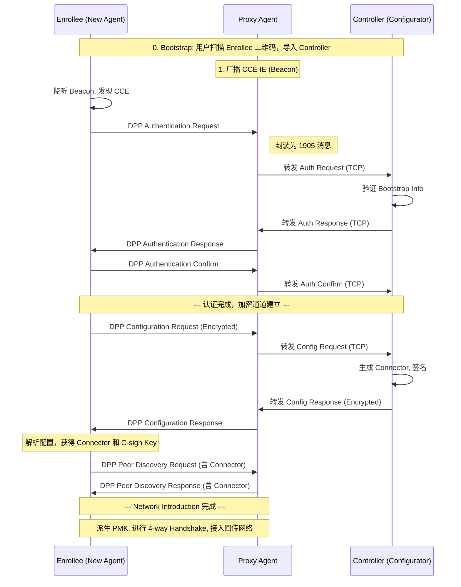

# DPP YYY 平台适配技术文档

**文档版本**: v1.0  
**创建日期**: 2025-12-16  
**适用平台**: YYY 无线芯片平台  
**基于标准**: Wi-Fi EasyMesh R3, Wi-Fi DPP Specification

---

## 1. 背景介绍

### 1.1 项目背景

在现代智能家居和企业网络环境中,Wi-Fi Mesh 网络已成为解决大面积无线覆盖的主流方案。Wi-Fi Alliance 推出的 **EasyMesh** 标准旨在实现不同厂商设备间的互操作性,提供统一的 Mesh 组网体验。

在 EasyMesh R3 版本中,引入了 **DPP (Device Provisioning Protocol)** 作为标准的设备配网协议,取代传统的 WPS (Wi-Fi Protected Setup) 机制。DPP 提供了更安全、更灵活的配网方式,支持通过 QR Code、NFC 等多种方式进行设备引导,并采用现代密码学技术保障配网过程的安全性。

**当前状况**:
- **XXX 平台**: 已基于 XXX 芯片平台及其对应版本的 hostapd/wpa_supplicant 完整实现了 EasyMesh DPP 功能,包括:
  - DPP Onboarding 完整流程
  - Proxy Agent 机制
  - CCE IE (Configurator Connectivity Element) 广播
  - Chirp 帧处理
  - 1905.1 层消息转发
  
- **YYY 平台**: 需要将上述功能适配到 YYY 芯片平台,基于 YYY 平台对应版本的 hostapd/wpa_supplicant 实现相同的 EasyMesh DPP 功能。

### 1.2 技术背景

#### Wi-Fi EasyMesh 简介

Wi-Fi EasyMesh 是一个多 AP 协同工作的标准,定义了以下核心角色:

- **Controller**: 网络控制器,负责整个 Mesh 网络的管理和配置
- **Agent**: 网络代理,接受 Controller 的管理,提供无线接入服务
- **Multi-AP Protocol**: 基于 IEEE 1905.1 标准的设备间通信协议

#### DPP 在 EasyMesh 中的作用

在 EasyMesh R3 中,DPP 主要用于:

1. **设备入网 (Onboarding)**: 新设备通过 DPP 协议安全地加入 Mesh 网络
2. **角色配置**: 将设备配置为 Controller 或 Agent 角色
3. **凭证分发**: 安全地分发网络访问凭证 (Connector, Network Access Key 等)
4. **信任建立**: 通过 Configurator 签名机制建立设备间的信任关系

#### 平台差异概述

XXX 和 YYY 两个平台在以下方面存在差异:

| 方面 | XXX 平台 | YYY 平台 | 影响 |
|------|----------|----------|------|
| **驱动接口** | XXX 私有驱动接口 | YYY 私有驱动接口 | DPP 帧收发机制需适配 |
| **无线协议栈** | XXX 协议栈实现 | YYY 协议栈实现 | Beacon/Action 帧处理需适配 |
| **配置管理** | XXX 配置工具链 | YYY 配置工具链 | 配置文件格式可能不同 |
| **hostapd 版本** | 基于特定版本 + XXX patch | 基于特定版本 + YYY patch | 代码合并策略需规划 |

### 1.3 适配需求说明

本次适配工作的核心目标是:

> **在 YYY 平台上实现与 XXX 平台功能对等的 EasyMesh DPP Onboarding 能力,确保 YYY 设备能够作为 Controller 或 Agent 参与 EasyMesh 网络,并通过 DPP 协议完成设备配网。**

**功能需求**:
- ✅ 支持 DPP Bootstrap (QR Code 方式)
- ✅ 支持 DPP Authentication
- ✅ 支持 DPP Configuration
- ✅ 支持 DPP Network Introduction
- ✅ 支持 Proxy Agent DPP Onboarding
- ✅ 支持 CCE IE 广播与解析
- ✅ 支持 Chirp 帧发送与接收
- ✅ 支持 1905.1 层 DPP 消息转发

**非功能需求**:
- 🔒 安全性: 符合 DPP 规范的安全要求
- 🔄 互操作性: 与其他 EasyMesh 认证设备互通
- ⚡ 性能: 配网时间在可接受范围内 (< 30 秒)
- 🛠️ 可维护性: 代码结构清晰,便于后续升级

---

## 2. 文档目的

### 2.1 文档目标

本文档旨在为 YYY 平台 DPP 适配工作提供全面的技术指导,具体目标包括:

1. **理论指导**: 详细阐述 DPP 协议的核心概念、流程和密钥体系,为适配工作提供理论基础
2. **架构参考**: 说明 hostapd/wpa_supplicant 中 DPP 功能的实现架构,帮助理解代码结构
3. **适配框架**: 提供 YYY 平台适配工作的框架和关键技术点,指导实际开发
4. **知识传承**: 作为团队知识库的一部分,便于后续维护和升级

### 2.2 目标读者

本文档面向以下读者:

- **嵌入式开发工程师**: 负责 YYY 平台驱动层和 hostapd/wpa_supplicant 适配
- **无线协议工程师**: 需要深入理解 DPP 协议细节
- **系统集成工程师**: 负责上层控制程序 (meshMgmt, easymesh) 的适配
- **测试工程师**: 需要了解 DPP 流程以设计测试用例

**前置知识要求**:
- 熟悉 C 语言编程
- 了解 Wi-Fi 基础知识 (802.11 协议栈)
- 了解 Linux 系统编程
- 了解基本的密码学概念 (公钥加密、数字签名等)

### 2.3 文档使用场景

本文档可用于以下场景:

1. **适配开发阶段**
   - 查阅 DPP 协议细节
   - 理解 hostapd/wpa_supplicant 代码实现
   - 确定平台差异和适配策略

2. **问题调试阶段**
   - 理解 DPP 消息流程,定位问题环节
   - 查找关键数据结构和函数
   - 分析日志和抓包数据

3. **代码审查阶段**
   - 验证实现是否符合协议规范
   - 检查安全性和健壮性
   - 评估代码质量

4. **知识学习阶段**
   - 学习 DPP 协议原理
   - 了解 EasyMesh 架构
   - 掌握 hostapd/wpa_supplicant 开发

### 2.4 文档结构说明

本文档按以下结构组织:

```
第 1-2 章: 背景与目的 (当前章节)
  ├─ 说明项目背景和文档目标

第 3 章: DPP 协议概述 ⭐ (核心章节)
  ├─ DPP 协议简介
  ├─ DPP 核心流程 (Bootstrap/Authentication/Configuration/Network Introduction)
  ├─ DPP 密钥体系 (Bootstrap Key/Protocol Key/Network Access Key/C-sign Key/Connector)
  ├─ DPP 在 EasyMesh 中的应用 (Proxy Agent/CCE IE/Chirp/1905.1 转发)
  └─ DPP 消息流程详解 (时序图和数据结构)

第 4 章: DPP 实现架构概要
  ├─ hostapd/wpa_supplicant 架构
  ├─ 关键模块说明
  ├─ 配置文件结构
  └─ 控制接口 (ctrl_iface)

第 5 章: YYY 平台适配工作框架
  ├─ 平台差异分析
  ├─ 适配工作清单
  ├─ 关键技术点
  └─ 测试验证方案

第 6 章: 参考资料
  └─ 规范文档、源码索引、相关文档
```

> [!IMPORTANT]
> **第 3 章 "DPP 协议概述"** 是本文档的核心,将详细讲解 DPP 协议的各个方面。实际的适配实现工作由开发人员完成,第 4-5 章仅提供框架和指导。

### 2.5 文档约定

**术语缩写**:
- DPP: Device Provisioning Protocol
- EasyMesh: Wi-Fi EasyMesh (Multi-AP 标准)
- CCE: Configurator Connectivity Element
- NAK: Network Access Key
- ECDH: Elliptic Curve Diffie-Hellman
- JWS: JSON Web Signature
- JWK: JSON Web Key
- PMK: Pairwise Master Key
- PMKSA: PMK Security Association

**代码引用**:
- 源码文件路径使用绝对路径链接
- 函数名使用 `code` 格式标注
- 数据结构使用 `struct xxx` 格式

**图表说明**:
- 使用 Mermaid 图表展示流程和架构
- 使用代码块展示配置和数据结构
- 使用表格对比差异

---

## 3. DPP 协议概述

> [!NOTE]
> 本章是文档的核心部分，全面解析 Wi-Fi DPP (Device Provisioning Protocol) 协议的机制与流程，为后续的适配开发提供理论支撑。

### 3.1 DPP 协议简介

**DPP (Device Provisioning Protocol)** 是 Wi-Fi Alliance 推出的一种现代化的设备配网和配置协议。它的核心目标是解决如何在没有预共享密钥（如 PSK）的情况下，安全、便捷地将设备（Enrollee）引入网络，并为其配置网络凭证。

与传统的 WPS (Wi-Fi Protected Setup) 相比，DPP 具有以下优势：
- **安全性更高**：基于公钥密码学（ECC），提供完善的前向安全（PFS）和端到端认证。
- **灵活性更强**：支持 QR Code、NFC、Bluetooth LE 等多种带外（OOB）引导方式。
- **扩展性更好**：不仅用于初次配网，还支持后续的配置更新和网络策略管理。

在 **EasyMesh R3** 网络中，DPP 取代了 WPS 成为标准的配网机制，使得 EasyMesh Controller 可以统一管理所有 Agent 可能的接入凭证。

### 3.2 DPP 核心流程

DPP 协议的完整生命周期包含四个逻辑阶段：

#### 1. Bootstrap 引导阶段
这是建立信任的起点。
- **机制**：通过二维码（QR Code）等带外通道，将设备的 **Bootstrap Public Key (Bi)** 和相关信息（MAC 地址、通道信息）传递给 Configurator。
- **结果**：Configurator 获得了 Enrollee 的公钥，双方尚未建立连接。

#### 2. Authentication 认证阶段
这是建立安全通道的过程。
- **机制**：双方通过 Wi-Fi Action 帧（DPP Authentication Request/Response/Confirm）进行三次握手。
- **核心动作**：
    - 使用 Bootstrap Key (Bi) 进行身份验证。
    - 交换临时生成的 **Protocol Key (Pi/Pr)**。
    - 基于 ECDH 生成共享密钥，建立加密通道。
- **结果**：双方均验证了对方持有的 Bootstrap Key，确立了信任，并协商出了用于加密后续配置帧的会话密钥（Ke）。

#### 3. Configuration 配置阶段
这是下发网络凭证的过程。
- **机制**：在 Authentication 建立的加密通道中，Configurator 向 Enrollee 发送配置信息。
- **核心动作**：
    - Configurator 生成 **Connector**（配置连接器）。
    - Configurator 发送 **DPP Configuration Request/Response**。
    - Enrollee 获得 **Connector**、**C-sign Key (公钥)** 和自身的 **Network Access Key (私钥)**。
- **结果**：Enrollee 获得了接入网络所需的所有凭证。

#### 4. Network Introduction 网络引入阶段
这是设备接入网络的最终步骤。
- **机制**：Enrollee 向 AP（或其他对等端）出示 Connector。
- **核心动作**：
    - 双方交换 Connector。
    - 验证 Connector 的签名（使用 C-sign Key）。
    - 基于 Network Access Key 进行 ECDH 协商。
    - 派生 **PMK (Pairwise Master Key)**。
- **结果**：双方生成了 PMK，随后即可进行标准的 4-way Handshake 接入网络。

### 3.3 DPP 密钥体系

DPP 的安全性依赖于一套严密的密钥体系，理解这些密钥对于适配工作至关重要。

| 密钥名称 | 符号 | 类型 | 生成/持有者 | 作用与生命周期 |
| :--- | :--- | :--- | :--- | :--- |
| **Bootstrap Key** | `Bi` | ECC 公私钥对 | Enrollee 预置或生成 | **[引导/认证阶段]** 用于初始信任建立。公钥通过 QR Code 传递，私钥不出设备。 |
| **Protocol Key** | `Pi` (Initiator)<br>`Pr` (Responder) | ECC 公私钥对 | 临时生成 | **[认证阶段]** 每次 DPP Authentication 过程中临时生成，用于保证前向安全（PFS）。 |
| **Network Access Key** | `N` | ECC 公私钥对 | 长期使用 | **[网络引入阶段]** Enrollee 的长期网络身份密钥。公钥封装在 Connector 中，私钥由 Enrollee 保存。用于生成 PMK。 |
| **C-sign Key** | `Cs` | ECC 公私钥对 | Configurator 持有 | **[信任根]** Configurator 的签名密钥。私钥用于签发（签名）Connector，公钥下发给所有设备用于验证 Connector。 |

#### Connector (连接器) 详解
Connector 是 DPP 中最重要的凭证载体，本质上是一个 **JWS (JSON Web Signature)** 对象。它可以类比为数字证书。

```json
// Connector 解码后的 JSON 结构示例
{
  "groups": [
    {
      "groupId": "EasyMesh_Network_01",
      "netRole": "mapAgent"  // 或 mapController, mapBackhaulSta
    }
  ],
  "netAccessKey": {          // Network Access Key 的公钥
    "kty": "EC",
    "crv": "P-256",
    "x": "...", 
    "y": "..."
  },
  "expiry": "2025-12-31T23:59:59Z"
}
```
*由 Configurator 使用 C-sign Key (私钥) 对上述内容签名。*

### 3.4 DPP 在 EasyMesh 中的应用

在 EasyMesh 网络中，DPP 的应用有其特殊性：

#### 1. 角色映射
- **Configurator**：通常由 **EasyMesh Controller** 扮演。它持有 C-sign Key，负责批准新设备入网。
- **Enrollee**：待入网的 **EasyMesh Agent** 设备。
- **Proxy Agent**：已入网的 Agent，作为中继者，帮助远端的 Configurator 与新设备通信。

#### 2. Proxy Agent DPP Onboarding
这是 EasyMesh 最典型的配网场景。当新设备（Enrollee）距离 Controller 较远时，需要通过已入网的 Agent（Proxy Agent）作为中介。

- **CCE (Configurator Connectivity Element)**：Proxy Agent 在 Beacon 中广播 CCE IE，标志着"我可以通过 1905 网络连接到 Configurator"。
- **DPP over TCP**：Proxy Agent 接收到 Enrollee 的无线 DPP 帧后，将其封装在 1905 协议中，通过 TCP 隧道转发给 Controller。

#### 3. Chirp 帧机制
当 Enrollee 想要被配网时，它会主动发送 **DPP Presence Announcement** 帧，俗称 **Chirp** 帧。
- **目的**：告诉周围的 Configurator 或 Proxy Agent "我在这里，请来配置我"。
- **Hash**：Chirp 帧中包含 Bootstrap Key 的 Hash 值，Configurator 需据此匹配扫描到的 QR Code 信息。

### 3.5 DPP 消息流程详解详解

#### 典型 EasyMesh 配网流程 (Proxy Agent 模式)



此流程图展示了适配工作中最复杂的场景：**DPP 帧的本地处理与远程转发**。MTK 平台的适配重点即在于如何正确截获这些 DPP 帧，并与上层 `meshMgmt` 或 `agent` 进程交互，实现上述转发逻辑。

---

## 4. DPP 实现架构概要

### 4.1 hostapd/wpa_supplicant 架构

DPP 功能主要集成在 `hostapd` (AP 侧) 和 `wpa_supplicant` (STA 侧) 中，核心逻辑位于 `src/common/dpp.c`。

```
hostapd / wpa_supplicant
├── src/common/dpp.c           <-- 核心协议逻辑 (Auth, Config, Intro, Crypto)
├── src/ap/dpp_hostapd.c       <-- hostapd 下的 DPP 处理 (AP 角色)
├── wpa_supplicant/dpp_supplicant.c <-- wpa_supplicant 下的 DPP 处理 (STA 角色)
├── src/drivers/               <-- 驱动层适配 (Action 帧收发)
└── wpa_supplicant/ctrl_iface.c <-- 上层控制接口 (meshMgmt 交互)
```

### 4.2 关键模块说明

- **dpp.c**: 实现了与平台无关的 DPP 协议状态机，包括生成密钥、解析 Frame、验证签名等。这是复用度最高的代码。
- **dpp_hostapd.c**: 处理 AP 侧特有的逻辑，如在 Beacon 中插入 CCE IE，处理接收到的 Action 帧，维护 Gas Server (用于 Config 阶段)。
- **dpp_supplicant.c**: 处理 STA 侧逻辑，如扫描带有 CCE 的 AP，发起 Authentication，发起 Network Introduction。

### 4.3 配置文件结构

#### wpa_supplicant.conf (STA 侧)
```conf
ctrl_interface=/var/run/wpa_supplicant
update_config=1
dpp_config_processing=2  # 允许被 Configurator 配置
```

#### hostapd.conf (AP 侧)
```conf
wpa=2
wpa_key_mgmt=DPP
ieee80211w=2             # DPP 要求必须开启 PMF (Mgmt Frame Protection)
dpp_connector=...        # 自身的 Connector (收到 Config 后由程序写入)
dpp_csign=...            # C-sign Key 公钥
dpp_netaccesskey=...     # 自身的私钥
```

### 4.4 控制接口 (ctrl_iface)

上层程序 (如 `meshMgmt` 或 `agent`) 通过 `wpa_cli` / `hostapd_cli` 或 Unix Socket 直接下发命令：

- **DPP_BOOTSTRAP_GEN type=qrcode**: 生成自身的 Bootstrap Key 和 QR Code 字符串。
- **DPP_AUTH_INIT peer=...**: 主动向某个 MAC 地址发起 Authentication。
- **DPP_CHIRP own=... iter=...**: Start sending Presence Announcement chirps.
- **DPP_LISTEN freq=...**: 监听 DPP 帧（Configurator 常用）。

---

## 5. YYY 平台适配工作框架

> [!IMPORTANT]
> 本章为**适配工作指南**。由于 YYY 平台的驱动和系统架构与 XXX 存在差异，请按照以下框架进行详细适配。

### 5.1 平台差异分析

| 模块 | XXX 实现参考 | YYY 适配方向 |
| :--- | :--- | :--- |
| **驱动接口** | 使用 XXX 私有的 Vendor command 或 cfg80211 扩展处理 Off-channel Action 帧 | 需确认 YYY 驱动（如 mt76 或私有驱动）是否支持标准的 `NL80211_CMD_FRAME` 用于发送 Action 帧，及 Off-channel TX 机制。 |
| **Beacon 管理** | 动态更新 IE (CCE IE) 的机制 | 确认 `hostapd` 是否能通过 standard 接口 (`UPDATE_BEACON`) 动态插入 CCE IE，或需调用 YYY 私有 iwpriv/ioctl。 |
| **配置文件** | 路径通常在 `/var/run/` 或 `/tmp/` | 确认 YYY OpenWrt/SDK 的配置路径，适配 `wpa_supplicant` 启动脚本。 |

### 5.2 适配工作清单

#### [ ] 1. 驱动层适配 (Driver Layer)
- **Action 帧发送**：验证 `driver_nl80211.c` 中的 `send_action` 是否能在 YYY 硬件上正常工作，特别是**非信道工作频率**（Off-channel）的发送。
- **Action 帧接收**：确保驱动能将接收到的 DPP Action 帧（Type 0x09 - Public Action）正确上报给 `hostapd`。

#### [ ] 2. hostapd/wpa_supplicant 适配
- **CCE IE 广播**：
    - 在 `src/ap/beacon.c` 中，确认 `ieee802_11_set_beacon` 能将 CCE IE 传递给驱动。
    - 验证：抓包查看 Beacon 帧中是否包含 `Element ID: 255 (Extension), ExtID: 106`。
- **TCP Tunnel 实现**：
    - 确保 `hostapd` 编译时开启了 `CONFIG_DPP2=y` 和 `CONFIG_DPP3=y`。
    - 验证 `gas_server.c` 和 `dpp_hostapd.c` 中关于 Controller 转发的逻辑。

#### [ ] 3. 上层控制程序适配
- **meshMgmt / agent 交互**：
    - 确保上层程序能正确解析 `hostapd` 发出的 `DPP-RX` 事件。
    - 适配 `DPP_AUTH_INIT` 命令的参数，确保能正确触发配网流程。

### 5.3 关键技术点与避坑指南

1. **Off-channel TX (切信道发送)**
    - DPP Authentication 过程通常发生在社交信道（如 2.4G 的 Ch1, Ch6, Ch11）。如果 AP 工作在 5G，它必须能通过 Time-slicing 切换到 2.4G 发送和接收帧。
    - **风险**：MTK 驱动如果不支持纯软件发起的 Off-channel TX，可能需要使用额外的监听接口。

2. **PMF (Protected Management Frames)**
    - DPP 协议强制要求 `ieee80211w=2` (Required)。
    - **风险**：确保 YYY 驱动完全支持 802.11w，否则 Network Introduction 后 4-way handshake 会失败。

3. **OpenSSL 版本兼容性**
    - DPP 强依赖 OpenSSL 的 ECC 功能。
    - **检查**：确认 SDK 中的 `libopenssl` 版本支持 P-256 / P-384 曲线。

### 5.4 测试验证方案

1. **基础功能测试**：使用安卓手机（支持 DPP 的，如 Pixel）作为 Configurator，扫描 YYY 设备生成的 QR Code，验证能否配网成功。
2. **EasyMesh 集成测试**：
    - 搭建 EasyMesh 环境，MTK 设备作为 Agent (Enrollee)。
    - 使用 XXX 设备作为 Controller。
    - 触发 Proxy Agent Onboarding 流程，抓包验证交互时序。

---

## 6. 参考资料

1. **Wi-Fi Alliance**: *Wi-Fi Device Provisioning Protocol (DPP) Specification v2.0 / v3.0*
2. **Wi-Fi Alliance**: *Wi-Fi EasyMesh Specification v3.0* (Section on DPP Onboarding)
3. **HostAP Project**: [DPP documentation](https://w1.fi/cgit/hostap/plain/hostapd/README-DPP)
4. **Source Code**:
    - `src/common/dpp.c`: [DPP Core Implementation](file:///home/soho/code/hostapd-wpad-basic-openssl/hostapd-2022-07-29-b704dc72-patched/src/common/dpp.c)
    - `src/ap/dpp_hostapd.c`: [AP DPP Handler](file:///home/soho/code/hostapd-wpad-basic-openssl/hostapd-2022-07-29-b704dc72-patched/src/ap/dpp_hostapd.c)

