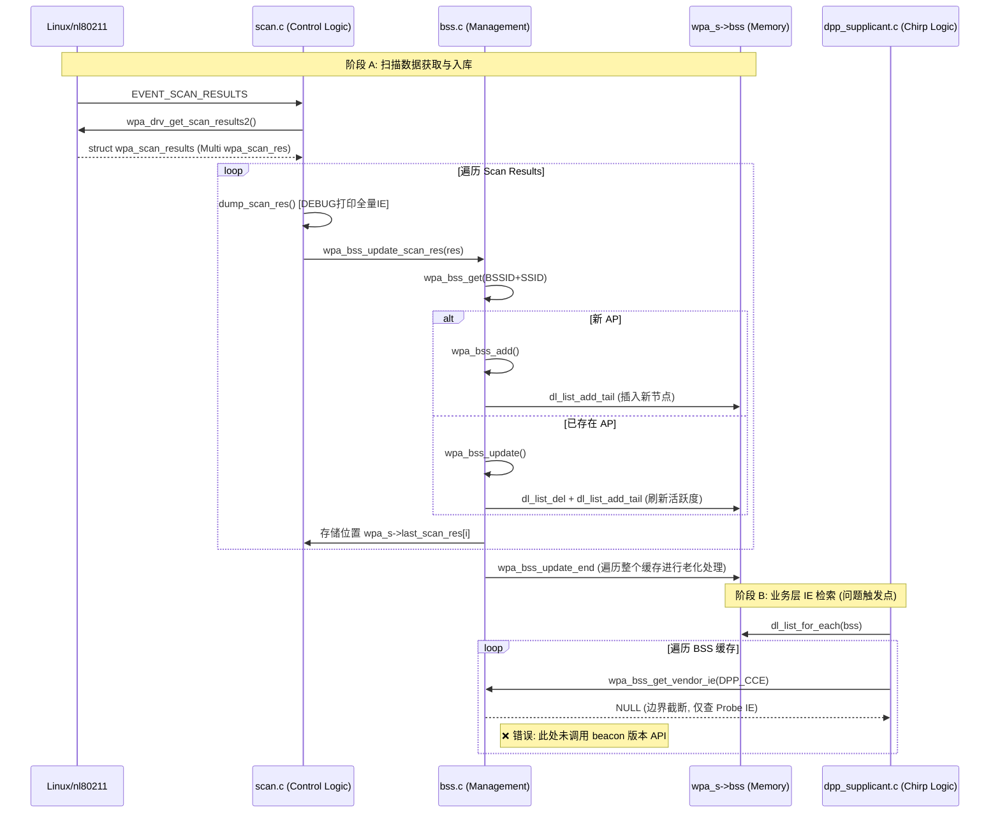

# wpa_supplicant 扫描结果缓存与 DPP IE 提取流程分析

## 0. 系统调用与数据流转全景 (Functional Architecture)

下表展示了从驱动层获取原始数据到 DPP 逻辑层的完整闭环，反映了 BSS 列表的动态更新与检索逻辑：



### 0.1 核心调用链追踪 (The Call Chain)

1.  **扫描完成事件驱动**：
    `wpa_supplicant_event_scan_results()` -> `wpa_supplicant_get_scan_results()`
2.  **获取与初步处理** ([scan.c:L2770](file:///home/soho/code/hostapd-wpad-basic-openssl/hostapd-2022-07-29-b704dc72-patched/wpa_supplicant/scan.c#L2770))：
    ```c
    /* wpa_supplicant/scan.c */
    scan_res = wpa_drv_get_scan_results2(wpa_s);
    if (scan_res) {
        wpa_bss_update_start(wpa_s);
        for (i = 0; i < scan_res->num; i++) {
            dump_scan_res(scan_res->res[i]); // 输出 hexdump
            wpa_bss_update_scan_res(wpa_s, scan_res->res[i], ...);
        }
        wpa_bss_update_end(wpa_s, ...); // 老化处理
    }
    ```

## 1. 扫描结果获取阶段 (Scan Result Acquisition)

当扫描完成时，`wpa_supplicant` 会调用驱动接口获取原始扫描数据。

- **核心函数**：`wpa_supplicant_get_scan_results()` ([scan.c:L2720](file:///home/soho/code/hostapd-wpad-basic-openssl/hostapd-2022-07-29-b704dc72-patched/wpa_supplicant/scan.c#L2720))
- **执行过程**：
    1. 通过驱动封装层从内核/驱动读取结果。
    2. 结果以 `struct wpa_scan_results` 结构返回，其中包含多个 `struct wpa_scan_res`。
    3. 每个 `wpa_scan_res` 独立记录了：
        - `ie_len`: Probe Response 帧中的 IE 长度。
        - `beacon_ie_len`: Beacon 帧中的 IE 长度。
        - 实际数据紧随结构体之后。

### 1.1 内存布局：变长数据存储的源码证据

您提到的 `sizeof(struct wpa_scan_res *)` 分配通常出现在分配 **指针数组**（即 `struct wpa_scan_results` 中的 `res` 成员）时。而具体的 **单个扫描结果条目** 的分配发生在驱动封装层。

以下是以 Linux 最常用的 `nl80211` 驱动为例的源码证据：

**1. 内存申请证据 (`src/drivers/driver_nl80211_scan.c:L767`)：**
驱动在解析内核上报的 BSS 信息时，计算了完整的变长空间：
```c
/* r 是 struct wpa_scan_res * */
r = os_zalloc(sizeof(*r) + ie_len + beacon_ie_len);
if (r == NULL) return NULL;
```

**2. 数据填充与指针偏移证据 (`src/drivers/driver_nl80211_scan.c:L817-825`)：**
分配内存后，驱动通过指针算术定位到结构体末尾，并按顺序拷贝数据：
```c
r->ie_len = ie_len;
pos = (u8 *) (r + 1); // 【关键】：跳过结构体本身大小，pos 现在指向尾随区域

if (ie) {
    os_memcpy(pos, ie, ie_len); // 拷贝第一部分 (Probe Response) IEs
    pos += ie_len;              // 指针后移
}

r->beacon_ie_len = beacon_ie_len;
if (beacon_ie)
    os_memcpy(pos, beacon_ie, beacon_ie_len); // 紧随其后拷贝第二部分 (Beacon) IEs
```

**3. 总结：**
- `wpa_scan_res` 结构体条目确实是在驱动层通过 **`sizeof(*r) + 额外长度`** 一次性申请的。
- 所有的 `os_memcpy` 目标地址都是基于 `(r + 1)` 得到的连续内存空间。
- 日志中看到的 `Beacon IEs` 能够被打印，正是因为这种“尾随存储”机制将它们合并存储在了该条目的内存尾部。

## 2. 扫描结果导出与调试阶段 (Log Dumping)

- **核心函数**：`dump_scan_res()` ([scan.c:L2177](file:///home/soho/code/hostapd-wpad-basic-openssl/hostapd-2022-07-29-b704dc72-patched/wpa_supplicant/scan.c#L2177))
- **源码片段**：
```c
/* wpa_supplicant/scan.c:L2221-2226 */
if (r->ie_len)
    wpa_hexdump(MSG_EXCESSIVE, "IEs", pos, r->ie_len);
pos += r->ie_len;
if (r->beacon_ie_len)
    wpa_hexdump(MSG_EXCESSIVE, "Beacon IEs", pos, r->beacon_ie_len);
```
- **逻辑特点**：
    - 遍历所有 `wpa_scan_res`。
    - **独立打印**：它会分别检查 `ie_len` 和 `beacon_ie_len`。只要有任何数据，都会通过 `wpa_hexdump` 打印出来。
    - **可见性**：这是为什么用户能在控制台日志看到 `50 6f ...` (DPP CCE IE) 的原因，因为它不分来源（Probe 或 Beacon）全部打印。

## 3. BSS 列表更新与存储阶段 (BSS List Update)

`wpa_supplicant` 使用全局 BSS 列表（`wpa_s->bss`）来持久化扫描结果。

- **核心函数**：`wpa_bss_update_scan_res()` ([bss.c:L763](file:///home/soho/code/hostapd-wpad-basic-openssl/hostapd-2022-07-29-b704dc72-patched/wpa_supplicant/bss.c#L763)) -> `wpa_bss_add()` ([bss.c:L452](file:///home/soho/code/hostapd-wpad-basic-openssl/hostapd-2022-07-29-b704dc72-patched/wpa_supplicant/bss.c#L452))
- **数据结构排布**：
    - `struct wpa_bss` 在内存中分配时，会预留空间：`sizeof(*bss) + res->ie_len + res->beacon_ie_len`。
    - **拷贝顺序**：
        1. 首先拷贝 Probe Response 的 IE 数据（`res->ie_len`）。
        2. 紧接着拷贝 Beacon 的 IE 数据（`res->beacon_ie_len`）。
    - 结构体中分别维护 `bss->ie_len` 和 `bss->beacon_ie_len` 指向各自部分的长度。

### 3.1 数据流转证据：从 scan_res 到 wpa_bss

是的，`wpa_s->bss` 中的数据**完全来源于驱动上报的 `scan_res`**。当 `wpa_supplicant` 接收到扫描结果时，它会将变长的 `scan_res` 转化为持久化的 `wpa_bss` 条目。

**源码证据 (`wpa_supplicant/bss.c:L460-470`)：**
在创建新的 BSS 缓存条目时，代码执行了显式的内存申请和拷贝：

```c
static struct wpa_bss * wpa_bss_add(struct wpa_supplicant *wpa_s, ...)
{
    // ...
    // 1. 根据 scan_res 中的 IE 长度申请 wpa_bss 内存
    bss = os_zalloc(sizeof(*bss) + res->ie_len + res->beacon_ie_len);

    // 2. 拷贝固定长度的基本信息 (freq, capability, signal 等)
    wpa_bss_copy_res(bss, res, fetch_time);

    // 3. 【核心拷贝】：将 scan_res 尾随的 IE 数据拷贝到 wpa_bss 的 ies 区域
    // res + 1 指向 scan_res 后的 IE 起始点
    os_memcpy(bss->ies, res + 1, res->ie_len + res->beacon_ie_len);
    // ...
}
```

**关键推论：**
1. **数据一致性**：由于是 `memcpy` 全量拷贝，只要 `scan_res` 里有这个 IE，`wpa_bss` 的内存里就一定有这个 IE。
2. **结构化转换**：`wpa_s->bss` 并不是直接引用驱动的内存，而是重新申请了一块长期有效的内存来保存这些数据的副本。
3. **IE 顺序保留**：拷贝函数完整保留了 IE 的原始排列顺序，因此 `ies` 的前半部分是 Probe Response，后半部分是 Beacon。

## 4. BSS 列表管理深度解析 (Deep Dive: BSS List Management)

在 `wpa_supplicant` 中，扫描结果的处理核心是 `wpa_bss_update_scan_res`。它负责将驱动层上报的原始数据（`struct wpa_scan_res`）转化为内部维护的库条目（`struct wpa_bss`）。

### 4.1 wpa_bss_update_scan_res 核心逻辑

该函数是处理单一扫描结果的入口点。其关键任务是判断该条目是“新发现”还是“已存在更新”，并维护 `last_scan_res` 索引。

```c
/* wpa_supplicant/bss.c */
void wpa_bss_update_scan_res(struct wpa_supplicant *wpa_s,
			     struct wpa_scan_res *res,
			     struct os_reltime *fetch_time)
{
	// 1. 获取 SSID (BSS 匹配的关键依据之一)
	ssid = wpa_scan_get_ie(res, WLAN_EID_SSID);
	if (ssid == NULL) return;

	// 2. 在现有缓存中查找 matching BSS
	bss = wpa_bss_get(wpa_s, res->bssid, ssid + 2, ssid[1]);

	if (bss == NULL)
		// 3a. 找不到则创建新条目并加入 wpa_s->bss
		bss = wpa_bss_add(wpa_s, ssid + 2, ssid[1], res, fetch_time);
	else
		// 3b. 找到了则更新旧条目数据
		bss = wpa_bss_update(wpa_s, bss, res, fetch_time);

	// 4. 将该 BSS 指针存入本次扫描的“快捷索引”数组
	if (wpa_s->last_scan_res)
		wpa_s->last_scan_res[wpa_s->last_scan_res_used++] = bss;
}
```

### 4.2 wpa_s->bss (全局 BSS 数据库)

`wpa_s->bss` 是一个 **双向循环链表**，存储了所有已知的扫描结果。

- **新增条目 (`wpa_bss_add`)**：
```c
/* wpa_supplicant/bss.c:L470 */
// 拷贝 IE 数据：Probe Response IE + Beacon IE 连续存放
os_memcpy(bss->ies, res + 1, res->ie_len + res->beacon_ie_len);

/* wpa_supplicant/bss.c:L481 */
// 将新创建的 bss 挂载到全局链表 wpa_s->bss 的末尾
dl_list_add_tail(&wpa_s->bss, &bss->list);
```

- **更新条目 (`wpa_bss_update`)**：
```c
/* wpa_supplicant/bss.c:L677-727 */
// 1. 从原位置删除
dl_list_del(&bss->list);

// 2. 更新数据 (如果 IE 长度增加会重新 malloc)
// ... 更新 IEs 和基本信息 ...

// 3. 重新插入链表末尾，以维持最近更新的顺序
dl_list_add_tail(&wpa_s->bss, &bss->list);
```

### 4.3 wpa_s->last_scan_res (本次扫描索引)

这是一个动态数组，其设计目的是为了让调用扫描的模块（如 DPP）能快速获取到 **“刚刚那次扫描中真正搜到的 AP”**，而不需要遍历包含大量过期缓存的全局 `wpa_s->bss` 链表。

- **差异点总结**：
| 结构 | 数据类型 | 生命周期 | 存储目的 |
| :--- | :--- | :--- | :--- |
| **`wpa_s->bss`** | `struct dl_list` (链表) | 长期存在 (跨扫描) | 充当系统的 BSS 记录数据库，用于重连、漫游决策。 |
| **`wpa_s->last_scan_res`**| `struct wpa_bss **` (数组) | 仅限本次扫描周期 | 提供给逻辑层，表示“这些是刚才扫描新鲜出炉的结果”。 |

## 5. 为什么 DPP 找不到 IE？ (关键代码证据)

为了回答“证据”问题，我们对比分析 `wpa_supplicant` 核心数据结构与检索 API 的实现。

### 5.1 内存布局证据 (bss.h)
在 `struct wpa_bss` 中，所有的 IE 数据都存储在一个名为 `ies` 的柔性数组中，但逻辑上被划分为两块：

```c
/* wpa_supplicant/bss.h:L125-131 */
struct wpa_bss {
    // ...
    size_t ie_len;        /* Probe Response 帧的 IE 长度 */
    size_t beacon_ie_len; /* Beacon 帧的 IE 长度 */
    /* 内存中紧跟 ie_len 字节的 Probe Response IEs */
    /* 然后紧跟 beacon_ie_len 字节的 Beacon IEs */
    u8 ies[]; 
};
```

### 5.2 检索函数对比证据 (bss.c)
这是最直接的“视而不见”证据。对比以下两个函数的实现：

| 函数 | 步进起始位置 | 搜索长度限制 (Boundary) |
| :--- | :--- | :--- |
| **`wpa_bss_get_vendor_ie`** | `bss->ies` | **`bss->ie_len`** |
| **`wpa_bss_get_vendor_ie_beacon`** | `bss->ies + bss->ie_len` | **`bss->beacon_ie_len`** |

**源码对比：**

```c
/* wpa_supplicant/bss.c:L1172 */
const u8 * wpa_bss_get_vendor_ie(const struct wpa_bss *bss, u32 vendor_type)
{
	ies = wpa_bss_ie_ptr(bss); // 等于 bss->ies
	// 【证据】：此处长度硬编码为 bss->ie_len。
	// 如果某个 IE 只在 Beacon 区域（即偏移量 > ie_len），这个循环永远不会走到那里。
	for_each_element_id(elem, WLAN_EID_VENDOR_SPECIFIC, ies, bss->ie_len) {
		if (elem->datalen >= 4 && vendor_type == WPA_GET_BE32(elem->data))
			return &elem->id;
	}
	return NULL;
}

/* wpa_supplicant/bss.c:L1201 */
const u8 * wpa_bss_get_vendor_ie_beacon(const struct wpa_bss *bss, u32 vendor_type)
{
	ies = wpa_bss_ie_ptr(bss);
	ies += bss->ie_len; // 【对比】：主动跳过了常规标头 IE，定位到 Beacon 起始区
	// 【对比】：此处限定只在 Beacon 长度范围内搜索
	for_each_element_id(elem, WLAN_EID_VENDOR_SPECIFIC, ies, bss->beacon_ie_len) {
		if (elem->datalen >= 4 && vendor_type == WPA_GET_BE32(elem->data))
			return &elem->id;
	}
	return NULL;
}
```

### 5.3 结论
执行 DPP 逻辑时调用的 `wpa_bss_get_vendor_ie` 函数，在代码实现层面**被硬性限定**了只能搜索 `ie_len`（Probe Response）范围内的数据。如果 CCE IE 被存储在 `beacon_ie_len` 对应的内存块中，该 API 确实表现为“视而不见”。

### 5.4 关键证据对照：存入 vs 检索 (Storage vs Retrieval Proof)

这是证明“数据在内存中但搜不到”的最强有力代码证据对照：

| 阶段 | 关键代码实现 | 覆盖范围 (Length) | 结果 |
| :--- | :--- | :--- | :--- |
| **数据存入** ([bss.c:L470](file:///home/soho/code/hostapd-wpad-basic-openssl/hostapd-2022-07-29-b704dc72-patched/wpa_supplicant/bss.c#L470)) | `os_memcpy(bss->ies, res + 1, res->ie_len + res->beacon_ie_len);` | **全部** (`ie_len + beacon_ie_len`) | IE `50 6f...` 物理上**已存入** `bss->ies` 缓冲区。 |
| **DPP 调用处** ([dpp_supplicant.c:L5004](file:///home/soho/code/hostapd-wpad-basic-openssl/hostapd-2022-07-29-b704dc72-patched/wpa_supplicant/dpp_supplicant.c#L5004)) | `if (wpa_bss_get_vendor_ie(bss, DPP_CC_IE_VENDOR_TYPE))` | - | 开始检索流程。 |
| **检索 API 实现** ([bss.c:L1179](file:///home/soho/code/hostapd-wpad-basic-openssl/hostapd-2022-07-29-b704dc72-patched/wpa_supplicant/bss.c#L1179)) | `for_each_element_id(elem, ..., ies, bss->ie_len)` | **局部** (`bss->ie_len`) | 搜索被**强行拦截**在前半段，无法触达存放在后半段的 Beacon IE 数据。 |

**代码逻辑推导：**
1. 内存库 `bss->ies` 的物理大小是 A+B。
2. 数据 `50 6f...` 存放在 B 区域（Beacon）。
3. 检索宏 `for_each_element_id` 的循环变量被限制在 `0` 到 `A` 之间。
4. **结论**：循环在遍历到 `A` 位置时就会立即终止并返回 `NULL`，永远无法“看见”位于 `A+1` 位置的数据。

## 6. 最终结论与修复思路

- **结论**：`wpa_s->bss` 里的数据是全的（Beacon IE 确实被存进去了），但是 **检索 API (`wpa_bss_get_vendor_ie`) 是残缺的**（它只看头不看尾）。
- **修复方案**：在 DPP 逻辑中，当 `wpa_bss_get_vendor_ie` 返回 `NULL` 时，必须显式调用 `wpa_bss_get_vendor_ie_beacon` 来检查被遗忘的 Beacon IE 数据块。

## 7. 生命周期深度对比 (Detailed Lifecycle Comparison)

理解这两者的生命周期对于调试“IE 消失”问题至关重要。

### 7.1 wpa_s->bss (全局缓存) —— “数据库”模式
它是系统的持久化存储，生命周期贯穿 `wpa_supplicant` 运行期间。

1.  **诞生 (Birth)**：在 `wpa_bss_add()` 中创建。当收到的 BSSID+SSID 在现有列表中找不到时，动态分配内存并加入链表。
2.  **存续 (Persistence)**：在后续的每次扫描中，如果再次搜到该 AP，`wpa_bss_update()` 会更新其时间戳、信号强度和 IE 内容。
3.  **老化 (Aging)**：
    -   每次扫描结束时，`wpa_bss_update_end()` 会检查链表。
    -   如果某个 BSS 应在本次扫描覆盖频率内，但实际没搜到（`bss->last_update_idx < wpa_s->bss_update_idx`），则增加其 `scan_miss_count`。
4.  **消亡 (Death)**：
    -   **超时剔除**：当 `scan_miss_count` 达到阈值（默认通常为 1，即只要一次没搜到就可能视作失效，取决于配置）。
    -   **容量剔除**：达到 `bss_max_count` 时，`wpa_bss_remove_oldest()` 会删掉最老的非关联条目。
    -   **主动清理**：执行 `FLUSH` 命令或 interface 关闭时调用 `wpa_bss_deinit()`。

### 7.2 wpa_s->last_scan_res (本次索引) —— “临时视图”模式
它是针对单次扫描操作的“结果快照”，生命周期随着扫描循环周而复始。

1.  **重置 (Reset)**：**[关键点]** 在每次新结果处理开始前，由 `wpa_bss_update_start()` 调用：
    ```c
    wpa_s->last_scan_res_used = 0; // 仅仅是将计数归零，复用旧的数组内存
    ```
2.  **填充 (Population)**：在 `wpa_bss_update_scan_res()` 中，每成功处理一个 `scan_res`，就将其对应的 `bss` 指针（无论是新生成的还是更新过的）填入数组。
3.  **使用 (Usage)**：扫描处理函数返回给上层（如 DPP）后，上层通常会遍历这个索引来执行逻辑。
4.  **失效 (Stale)**：一旦下一次扫描触发并进入 `wpa_bss_update_start()`，上一次的索引就彻底消失了（虽然内存中那些 `bss` 对象可能还在，但数组已经不再指向它们）。

### 7.3 总结对比表

| 特性 | wpa_s->bss (链表) | wpa_s->last_scan_res (数组) |
| :--- | :--- | :--- |
| **内存分配** | 每个 AP 独立 `malloc` | 一个连续的大块指针内存 |
| **重置频率** | 从不整体重置（除非 Flush） | **每次处理扫描结果前必定重置** |
| **存在意义** | 记住“曾经”搜到过的所有 AP | 仅仅记住“这次”搜到了哪些 AP |
| **DPP 影响** | **Chirp 逻辑遍历的是它**，所以能搜到历史缓存。| 如果 DPP 切换到遍历它，则只能找到当前这一次搜到的 AP。 |

### 7.4 老化机制源码证据 (Aging Logic)

当扫描不到某个 AP 时，系统会通过“往回”检查来清理列表：

```c
/* wpa_supplicant/bss.c:L920 */
void wpa_bss_update_end(struct wpa_supplicant *wpa_s, ...)
{
    // 向后遍历全局链表
    dl_list_for_each_safe(bss, n, &wpa_s->bss, struct wpa_bss, list) {
        // 如果本次扫描覆盖了该频率但没搜到该 BSS
        if (wpa_bss_included_in_scan(bss, info) && 
            bss->last_update_idx < wpa_s->bss_update_idx)
        {
            bss->scan_miss_count++; // 判定为 Miss
            if (bss->scan_miss_count >= threshold)
                wpa_bss_remove(wpa_s, bss, "no match in scan"); // 销毁对象
        }
    }
}
```

**逻辑闭环点**：
- `wpa_bss_add` 负责“往链表里塞数据”。
- `wpa_bss_update_end` 负责“从链表里吐数据（清理）”。
- 该“往回遍历全表”的动作确保了 `wpa_s->bss` 不会无限膨胀。
