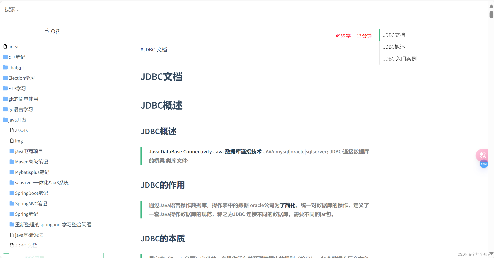

# 使用 Docsify 部署 Github Pages 博客

> 基于 [CSDN 教程](https://blog.csdn.net/qq_74177889/article/details/139595564) 整理

效果图



## 1. Docsify 基础安装

### 安装工具

```bash
npm i docsify-cli -g
```

### 初始化项目

```bash
docsify init ./docs
```

### 启动服务

```bash
docsify serve
```

访问 `http://localhost:3000` 即可预览。

## 2. 基础侧边栏配置

默认情况下，Docsify 不显示侧边栏。要启用它：

1.  在 `index.html` 中配置 `loadSidebar: true`：
    ```html
    <script>
      window.$docsify = {
        loadSidebar: true
      }
    </script>
    ```

2.  创建 `_sidebar.md` 文件：
    ```markdown
    * [Home](/)
    * [Guide](guide.md)
    ```

## 3. 自动生成目录

如果不想手动维护 `_sidebar.md`，可以使用工具自动生成。
